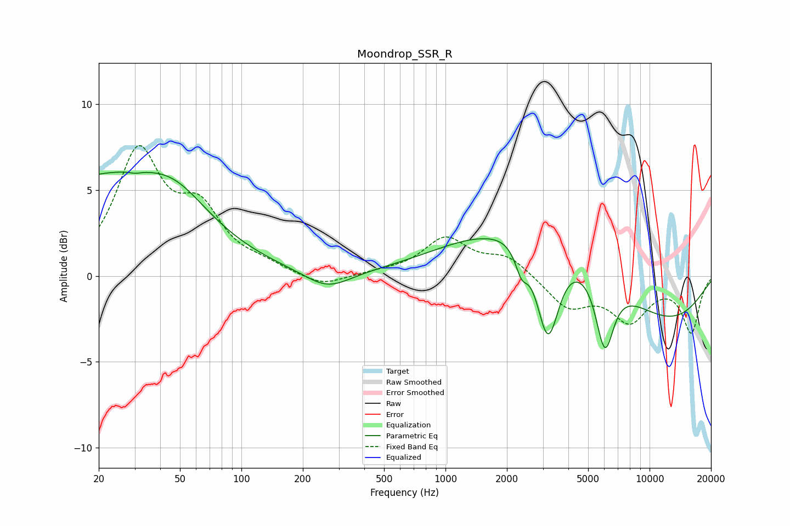

# Moondrop_SSR_R
See [usage instructions](https://github.com/jaakkopasanen/AutoEq#usage) for more options and info.

### Parametric EQs
Apply preamp of -6.1 dB when using parametric equalizer.

|   # | Type    |   Fc (Hz) |    Q |   Gain (dB) |
|-----|---------|-----------|------|-------------|
|   1 | Peaking |        21 | 0.33 |         5.6 |
|   2 | Peaking |        30 | 5.57 |        -0.1 |
|   3 | Peaking |        47 | 0.94 |         1.6 |
|   4 | Peaking |       265 | 1.26 |        -1.1 |
|   5 | Peaking |      1572 | 1.52 |        -0.1 |
|   6 | Peaking |      2359 | 4.57 |        -1.4 |
|   7 | Peaking |      3177 | 2.52 |        -5.7 |
|   8 | Peaking |      3577 | 0.3  |         4.2 |
|   9 | Peaking |      6033 | 3.09 |        -4.3 |
|  10 | Peaking |     10000 | 0.4  |        -4   |

### Fixed Band EQs
When using fixed band (also called graphic) equalizer, apply preamp of **-7.7 dB** (if available) and set gains manually with these parameters.

|   # | Type    |   Fc (Hz) |    Q |   Gain (dB) |
|-----|---------|-----------|------|-------------|
|   1 | Peaking |        31 | 1.41 |         6.9 |
|   2 | Peaking |        62 | 1.41 |         3.3 |
|   3 | Peaking |       125 | 1.41 |         0.5 |
|   4 | Peaking |       250 | 1.41 |        -0.7 |
|   5 | Peaking |       500 | 1.41 |         0.2 |
|   6 | Peaking |      1000 | 1.41 |         2.1 |
|   7 | Peaking |      2000 | 1.41 |         1.1 |
|   8 | Peaking |      4000 | 1.41 |        -1.8 |
|   9 | Peaking |      8000 | 1.41 |        -2.4 |
|  10 | Peaking |     16000 | 1.41 |        -3.2 |

### Graphs

