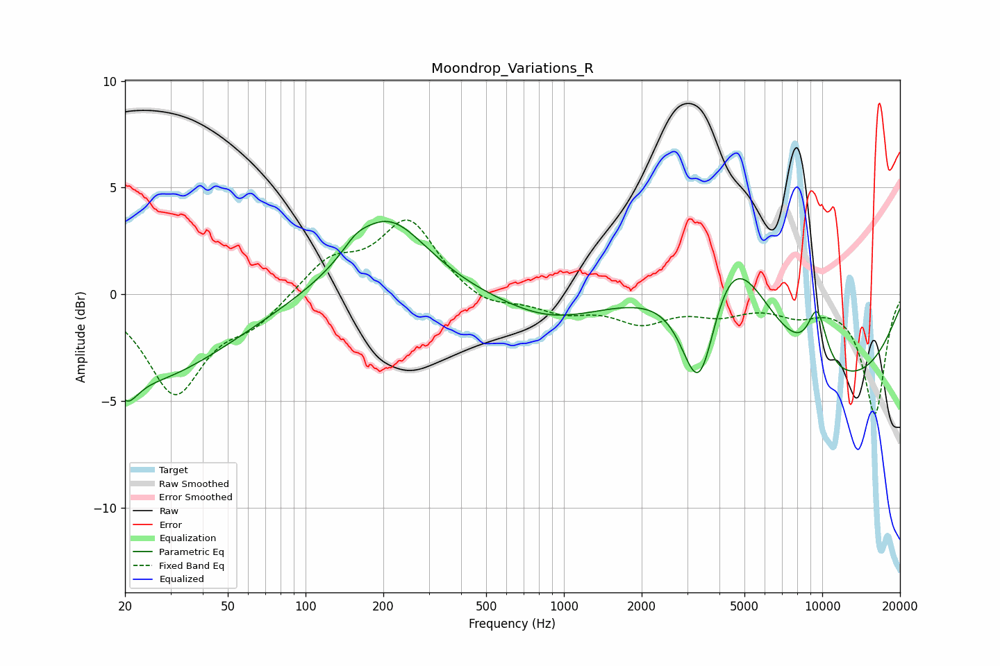

# Moondrop_Variations_R
See [usage instructions](https://github.com/jaakkopasanen/AutoEq#usage) for more options and info.

### Parametric EQs
Apply preamp of -3.5 dB when using parametric equalizer.

|   # | Type    |   Fc (Hz) |    Q |   Gain (dB) |
|-----|---------|-----------|------|-------------|
|   1 | Peaking |        20 | 5.56 |        -0.7 |
|   2 | Peaking |        22 | 0.41 |        -4.1 |
|   3 | Peaking |        22 | 4.22 |        -0.3 |
|   4 | Peaking |       157 | 3.18 |         0.4 |
|   5 | Peaking |       206 | 0.91 |         3.7 |
|   6 | Peaking |       881 | 0.73 |        -1.2 |
|   7 | Peaking |      3351 | 1.92 |        -6.7 |
|   8 | Peaking |      4214 | 0.87 |         6.6 |
|   9 | Peaking |      9560 | 3.27 |         2.6 |
|  10 | Peaking |      9820 | 0.31 |        -4.6 |

### Fixed Band EQs
When using fixed band (also called graphic) equalizer, apply preamp of **-3.6 dB** (if available) and set gains manually with these parameters.

|   # | Type    |   Fc (Hz) |    Q |   Gain (dB) |
|-----|---------|-----------|------|-------------|
|   1 | Peaking |        31 | 1.41 |        -4.6 |
|   2 | Peaking |        62 | 1.41 |        -1.2 |
|   3 | Peaking |       125 | 1.41 |         1.6 |
|   4 | Peaking |       250 | 1.41 |         3.4 |
|   5 | Peaking |       500 | 1.41 |        -0.7 |
|   6 | Peaking |      1000 | 1.41 |        -0.7 |
|   7 | Peaking |      2000 | 1.41 |        -1.2 |
|   8 | Peaking |      4000 | 1.41 |        -0.8 |
|   9 | Peaking |      8000 | 1.41 |        -0.8 |
|  10 | Peaking |     16000 | 1.41 |        -5.6 |

### Graphs

