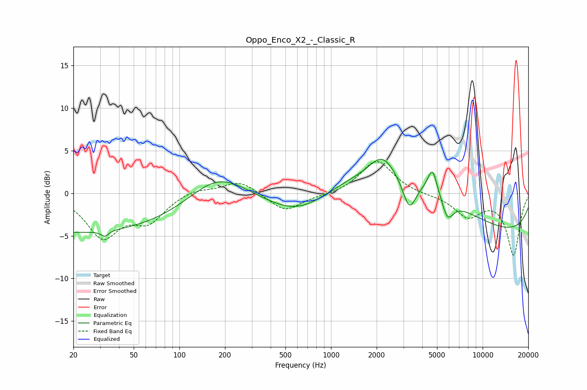

# Oppo_Enco_X2_-_Classic_R
See [usage instructions](https://github.com/jaakkopasanen/AutoEq#usage) for more options and info.

### Parametric EQs
Apply preamp of -4.1 dB when using parametric equalizer.

|   # | Type    |   Fc (Hz) |    Q |   Gain (dB) |
|-----|---------|-----------|------|-------------|
|   1 | Peaking |        22 | 0.18 |        -4.6 |
|   2 | Peaking |        32 | 6    |        -0.7 |
|   3 | Peaking |       178 | 0.76 |         3.2 |
|   4 | Peaking |       604 | 0.68 |        -2.8 |
|   5 | Peaking |      2177 | 1.79 |         2.4 |
|   6 | Peaking |      3048 | 0.36 |         5.3 |
|   7 | Peaking |      3284 | 3.16 |        -3.7 |
|   8 | Peaking |      4671 | 4.44 |         3   |
|   9 | Peaking |      5873 | 3.58 |        -2.5 |
|  10 | Peaking |     10000 | 0.18 |        -5   |

### Fixed Band EQs
When using fixed band (also called graphic) equalizer, apply preamp of **-3.8 dB** (if available) and set gains manually with these parameters.

|   # | Type    |   Fc (Hz) |    Q |   Gain (dB) |
|-----|---------|-----------|------|-------------|
|   1 | Peaking |        31 | 1.41 |        -4.9 |
|   2 | Peaking |        62 | 1.41 |        -3   |
|   3 | Peaking |       125 | 1.41 |         0.6 |
|   4 | Peaking |       250 | 1.41 |         1.5 |
|   5 | Peaking |       500 | 1.41 |        -2.2 |
|   6 | Peaking |      1000 | 1.41 |        -0.2 |
|   7 | Peaking |      2000 | 1.41 |         3.9 |
|   8 | Peaking |      4000 | 1.41 |        -0.1 |
|   9 | Peaking |      8000 | 1.41 |        -2.6 |
|  10 | Peaking |     16000 | 1.41 |        -7.2 |

### Graphs

