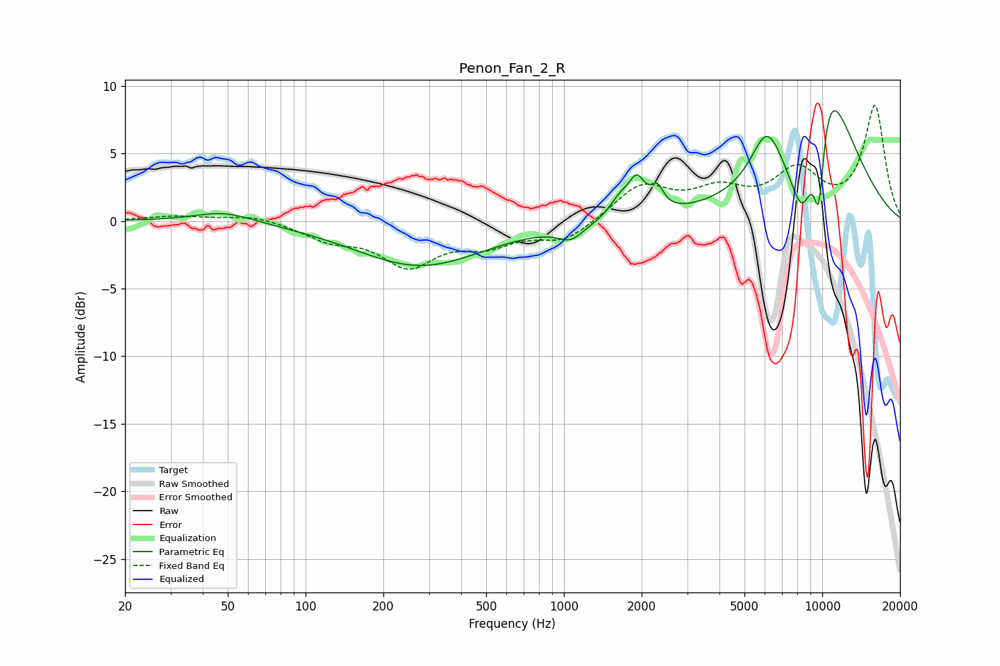

# Penon_Fan_2_R
See [usage instructions](https://github.com/jaakkopasanen/AutoEq#usage) for more options and info.

### Parametric EQs
Apply preamp of -8.2 dB when using parametric equalizer.

|   # | Type    |   Fc (Hz) |    Q |   Gain (dB) |
|-----|---------|-----------|------|-------------|
|   1 | Peaking |        48 | 1.22 |         0.8 |
|   2 | Peaking |       277 | 0.57 |        -3.3 |
|   3 | Peaking |      1064 | 2.84 |        -1   |
|   4 | Peaking |      1648 | 3.5  |         1.3 |
|   5 | Peaking |      1916 | 4.57 |         2.4 |
|   6 | Peaking |      2296 | 5.75 |         1.5 |
|   7 | Peaking |      6093 | 2.31 |         3.7 |
|   8 | Peaking |      8437 | 2.15 |        -8.4 |
|   9 | Peaking |      9704 | 5.68 |        -6.7 |
|  10 | Peaking |     10000 | 0.99 |        12.8 |

### Fixed Band EQs
When using fixed band (also called graphic) equalizer, apply preamp of **-8.6 dB** (if available) and set gains manually with these parameters.

|   # | Type    |   Fc (Hz) |    Q |   Gain (dB) |
|-----|---------|-----------|------|-------------|
|   1 | Peaking |        31 | 1.41 |         0.4 |
|   2 | Peaking |        62 | 1.41 |         0.5 |
|   3 | Peaking |       125 | 1.41 |        -1.2 |
|   4 | Peaking |       250 | 1.41 |        -3.1 |
|   5 | Peaking |       500 | 1.41 |        -1.5 |
|   6 | Peaking |      1000 | 1.41 |        -1.5 |
|   7 | Peaking |      2000 | 1.41 |         2.6 |
|   8 | Peaking |      4000 | 1.41 |         1.9 |
|   9 | Peaking |      8000 | 1.41 |         3.4 |
|  10 | Peaking |     16000 | 1.41 |         8.4 |

### Graphs

