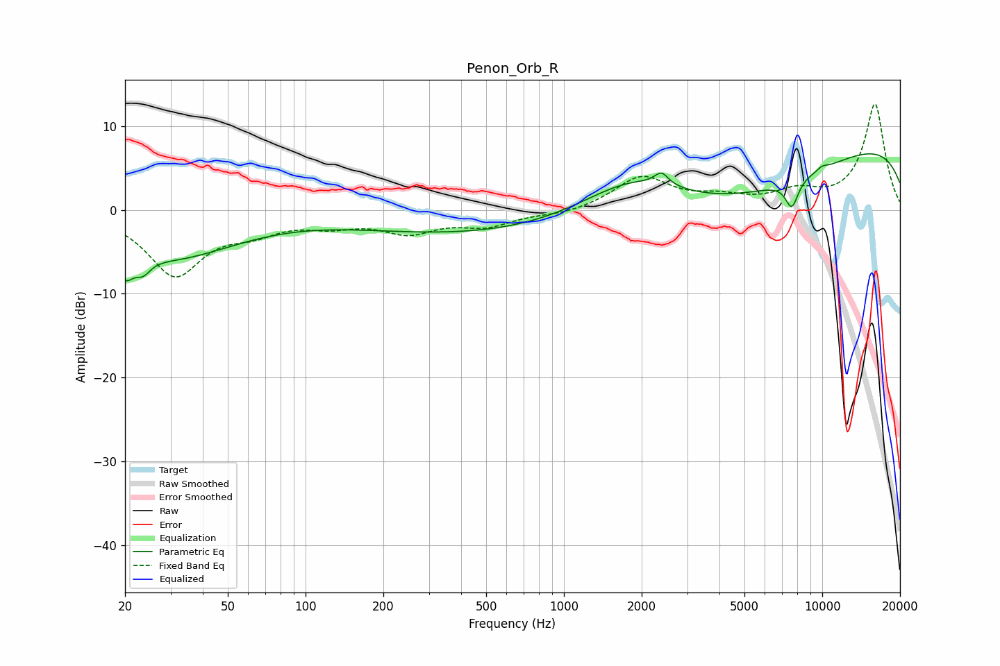

# Penon_Orb_R
See [usage instructions](https://github.com/jaakkopasanen/AutoEq#usage) for more options and info.

### Parametric EQs
Apply preamp of -6.8 dB when using parametric equalizer.

|   # | Type    |   Fc (Hz) |    Q |   Gain (dB) |
|-----|---------|-----------|------|-------------|
|   1 | Peaking |        20 | 4.42 |        -3.2 |
|   2 | Peaking |        23 | 4.84 |        -1.6 |
|   3 | Peaking |        30 | 0.54 |        -5.5 |
|   4 | Peaking |       803 | 0.18 |        -3.3 |
|   5 | Peaking |      1852 | 0.55 |         9.1 |
|   6 | Peaking |      2387 | 5.44 |         1.5 |
|   7 | Peaking |      4774 | 0.24 |       -10.3 |
|   8 | Peaking |      7626 | 5.36 |        -3.2 |
|   9 | Peaking |     10000 | 6    |         0.4 |
|  10 | Peaking |     10000 | 0.22 |        12.7 |

### Fixed Band EQs
When using fixed band (also called graphic) equalizer, apply preamp of **-12.7 dB** (if available) and set gains manually with these parameters.

|   # | Type    |   Fc (Hz) |    Q |   Gain (dB) |
|-----|---------|-----------|------|-------------|
|   1 | Peaking |        31 | 1.41 |        -7.6 |
|   2 | Peaking |        62 | 1.41 |        -1.9 |
|   3 | Peaking |       125 | 1.41 |        -1.4 |
|   4 | Peaking |       250 | 1.41 |        -2.4 |
|   5 | Peaking |       500 | 1.41 |        -1.7 |
|   6 | Peaking |      1000 | 1.41 |        -0.5 |
|   7 | Peaking |      2000 | 1.41 |         3.9 |
|   8 | Peaking |      4000 | 1.41 |         1.2 |
|   9 | Peaking |      8000 | 1.41 |         1.8 |
|  10 | Peaking |     16000 | 1.41 |        12.6 |

### Graphs

