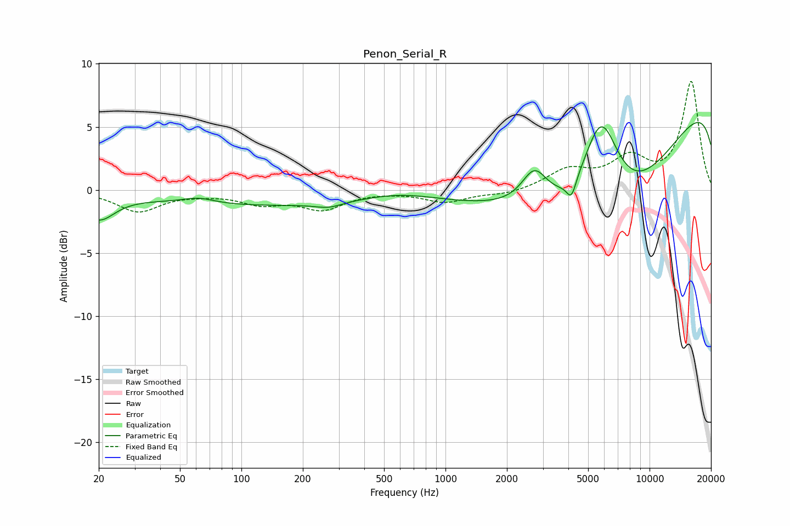

# Penon_Serial_R
See [usage instructions](https://github.com/jaakkopasanen/AutoEq#usage) for more options and info.

### Parametric EQs
Apply preamp of -5.4 dB when using parametric equalizer.

|   # | Type    |   Fc (Hz) |    Q |   Gain (dB) |
|-----|---------|-----------|------|-------------|
|   1 | Peaking |        20 | 1.82 |        -2   |
|   2 | Peaking |        61 | 1.79 |         0.5 |
|   3 | Peaking |       173 | 0.19 |        -1.3 |
|   4 | Peaking |       268 | 2.25 |        -0.4 |
|   5 | Peaking |       592 | 0.7  |         0.9 |
|   6 | Peaking |      2729 | 2.26 |         2.7 |
|   7 | Peaking |      4143 | 5.99 |        -1.5 |
|   8 | Peaking |      5792 | 1.44 |         8.5 |
|   9 | Peaking |      6302 | 0.32 |       -15.2 |
|  10 | Peaking |     10000 | 0.18 |        12.6 |

### Fixed Band EQs
When using fixed band (also called graphic) equalizer, apply preamp of **-8.7 dB** (if available) and set gains manually with these parameters.

|   # | Type    |   Fc (Hz) |    Q |   Gain (dB) |
|-----|---------|-----------|------|-------------|
|   1 | Peaking |        31 | 1.41 |        -1.7 |
|   2 | Peaking |        62 | 1.41 |        -0.2 |
|   3 | Peaking |       125 | 1.41 |        -1   |
|   4 | Peaking |       250 | 1.41 |        -1.4 |
|   5 | Peaking |       500 | 1.41 |        -0   |
|   6 | Peaking |      1000 | 1.41 |        -0.9 |
|   7 | Peaking |      2000 | 1.41 |        -0.4 |
|   8 | Peaking |      4000 | 1.41 |         1.5 |
|   9 | Peaking |      8000 | 1.41 |         2.3 |
|  10 | Peaking |     16000 | 1.41 |         8.5 |

### Graphs

