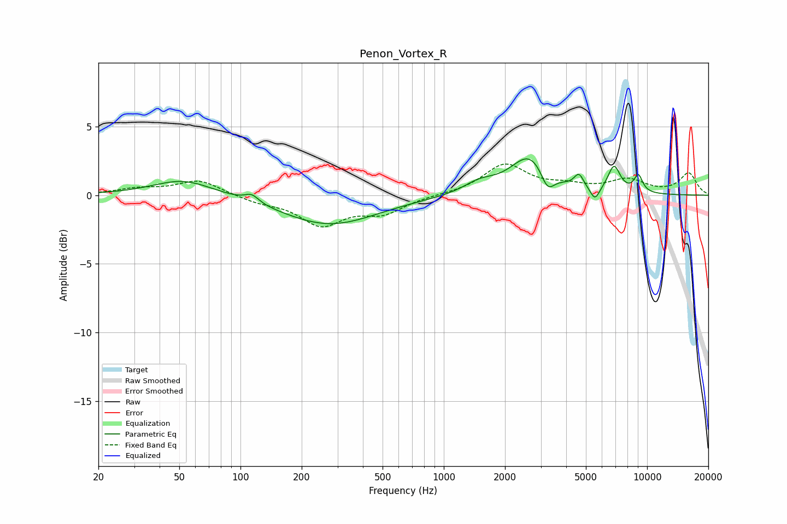

# Penon_Vortex_R
See [usage instructions](https://github.com/jaakkopasanen/AutoEq#usage) for more options and info.

### Parametric EQs
Apply preamp of -2.7 dB when using parametric equalizer.

|   # | Type    |   Fc (Hz) |    Q |   Gain (dB) |
|-----|---------|-----------|------|-------------|
|   1 | Peaking |        52 | 0.95 |         1.2 |
|   2 | Peaking |       114 | 4.16 |         0.6 |
|   3 | Peaking |       274 | 0.6  |        -2.1 |
|   4 | Peaking |      1500 | 1.76 |         0.8 |
|   5 | Peaking |      2661 | 1.49 |         2.9 |
|   6 | Peaking |      3238 | 4.17 |        -1.5 |
|   7 | Peaking |      4620 | 5.99 |         1   |
|   8 | Peaking |      5541 | 6    |        -1   |
|   9 | Peaking |      6878 | 4.43 |         1.9 |
|  10 | Peaking |      9055 | 5.89 |         1.3 |

### Fixed Band EQs
When using fixed band (also called graphic) equalizer, apply preamp of **-2.4 dB** (if available) and set gains manually with these parameters.

|   # | Type    |   Fc (Hz) |    Q |   Gain (dB) |
|-----|---------|-----------|------|-------------|
|   1 | Peaking |        31 | 1.41 |         0.4 |
|   2 | Peaking |        62 | 1.41 |         1.1 |
|   3 | Peaking |       125 | 1.41 |        -0.4 |
|   4 | Peaking |       250 | 1.41 |        -2.1 |
|   5 | Peaking |       500 | 1.41 |        -1.2 |
|   6 | Peaking |      1000 | 1.41 |         0   |
|   7 | Peaking |      2000 | 1.41 |         2.2 |
|   8 | Peaking |      4000 | 1.41 |         0.5 |
|   9 | Peaking |      8000 | 1.41 |         1   |
|  10 | Peaking |     16000 | 1.41 |         1.6 |

### Graphs

