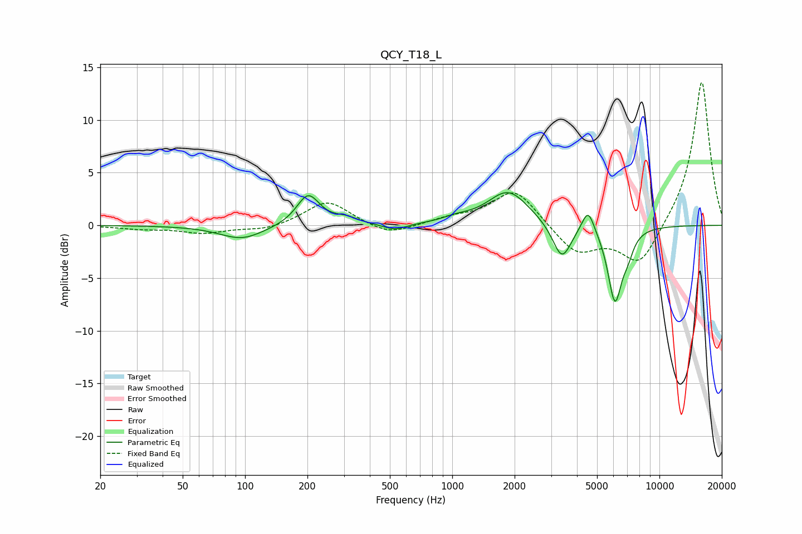

# QCY_T18_L
See [usage instructions](https://github.com/jaakkopasanen/AutoEq#usage) for more options and info.

### Parametric EQs
Apply preamp of -3.2 dB when using parametric equalizer.

|   # | Type    |   Fc (Hz) |    Q |   Gain (dB) |
|-----|---------|-----------|------|-------------|
|   1 | Peaking |        97 | 1.34 |        -1.3 |
|   2 | Peaking |       202 | 2.55 |         2.9 |
|   3 | Peaking |       307 | 2.51 |         0.6 |
|   4 | Peaking |       528 | 2.45 |        -0.6 |
|   5 | Peaking |      1049 | 2.15 |         0.4 |
|   6 | Peaking |      1864 | 1.43 |         3.3 |
|   7 | Peaking |      3383 | 3.13 |        -3.5 |
|   8 | Peaking |      4526 | 4.61 |         2.3 |
|   9 | Peaking |      6097 | 4    |        -7   |
|  10 | Peaking |      7036 | 4.88 |        -1.4 |

### Fixed Band EQs
When using fixed band (also called graphic) equalizer, apply preamp of **-13.7 dB** (if available) and set gains manually with these parameters.

|   # | Type    |   Fc (Hz) |    Q |   Gain (dB) |
|-----|---------|-----------|------|-------------|
|   1 | Peaking |        31 | 1.41 |        -0.3 |
|   2 | Peaking |        62 | 1.41 |        -0.7 |
|   3 | Peaking |       125 | 1.41 |        -0.5 |
|   4 | Peaking |       250 | 1.41 |         2.4 |
|   5 | Peaking |       500 | 1.41 |        -1   |
|   6 | Peaking |      1000 | 1.41 |         0.6 |
|   7 | Peaking |      2000 | 1.41 |         3.5 |
|   8 | Peaking |      4000 | 1.41 |        -2.7 |
|   9 | Peaking |      8000 | 1.41 |        -3.9 |
|  10 | Peaking |     16000 | 1.41 |        13.9 |

### Graphs

