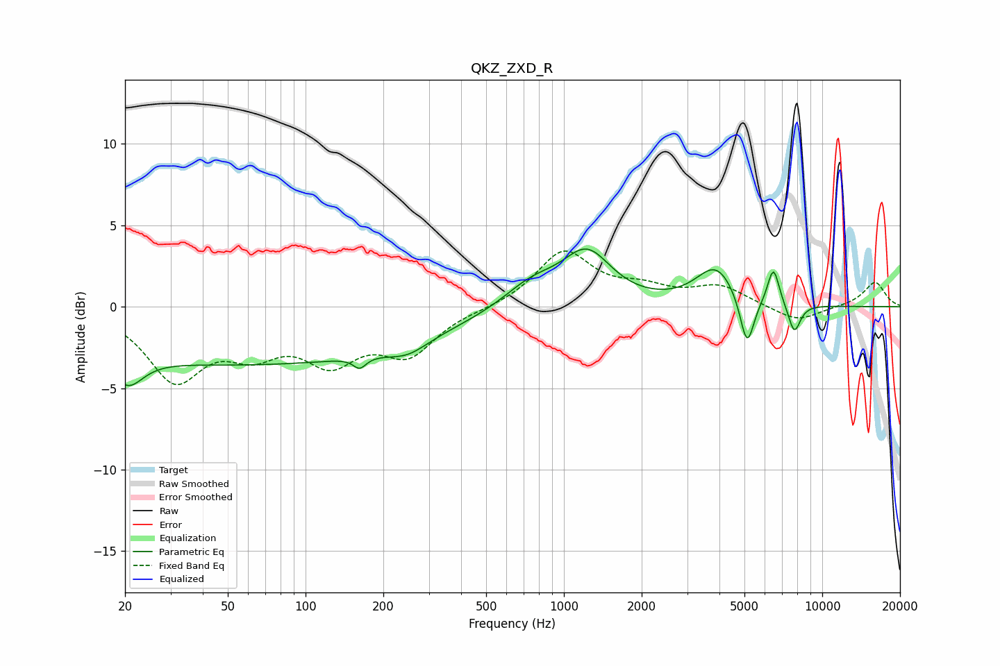

# QKZ_ZXD_R
See [usage instructions](https://github.com/jaakkopasanen/AutoEq#usage) for more options and info.

### Parametric EQs
Apply preamp of -3.6 dB when using parametric equalizer.

|   # | Type    |   Fc (Hz) |    Q |   Gain (dB) |
|-----|---------|-----------|------|-------------|
|   1 | Peaking |        20 | 2.36 |        -2   |
|   2 | Peaking |        60 | 0.18 |        -3.5 |
|   3 | Peaking |       162 | 5.81 |        -0.7 |
|   4 | Peaking |       248 | 1.81 |        -0.8 |
|   5 | Peaking |       749 | 1.26 |         1.5 |
|   6 | Peaking |      1229 | 1.5  |         3.2 |
|   7 | Peaking |      3879 | 1.83 |         2.4 |
|   8 | Peaking |      5117 | 5.04 |        -3.2 |
|   9 | Peaking |      6472 | 6    |         2.3 |
|  10 | Peaking |      7795 | 5.58 |        -1.8 |

### Fixed Band EQs
When using fixed band (also called graphic) equalizer, apply preamp of **-3.5 dB** (if available) and set gains manually with these parameters.

|   # | Type    |   Fc (Hz) |    Q |   Gain (dB) |
|-----|---------|-----------|------|-------------|
|   1 | Peaking |        31 | 1.41 |        -4.2 |
|   2 | Peaking |        62 | 1.41 |        -2.2 |
|   3 | Peaking |       125 | 1.41 |        -2.9 |
|   4 | Peaking |       250 | 1.41 |        -2.7 |
|   5 | Peaking |       500 | 1.41 |        -0.1 |
|   6 | Peaking |      1000 | 1.41 |         3.4 |
|   7 | Peaking |      2000 | 1.41 |         0.9 |
|   8 | Peaking |      4000 | 1.41 |         1.2 |
|   9 | Peaking |      8000 | 1.41 |        -1   |
|  10 | Peaking |     16000 | 1.41 |         1.5 |

### Graphs

