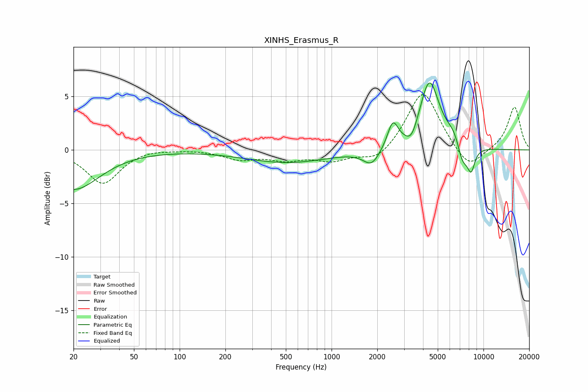

# XINHS_Erasmus_R
See [usage instructions](https://github.com/jaakkopasanen/AutoEq#usage) for more options and info.

### Parametric EQs
Apply preamp of -6.4 dB when using parametric equalizer.

|   # | Type    |   Fc (Hz) |    Q |   Gain (dB) |
|-----|---------|-----------|------|-------------|
|   1 | Peaking |        20 | 0.84 |        -3.7 |
|   2 | Peaking |       511 | 0.52 |        -1.2 |
|   3 | Peaking |      1836 | 2.6  |        -1.5 |
|   4 | Peaking |      2532 | 4.01 |         2.4 |
|   5 | Peaking |      3361 | 3.79 |        -1.2 |
|   6 | Peaking |      4406 | 2.16 |         6.4 |
|   7 | Peaking |      6605 | 2.38 |         1.7 |
|   8 | Peaking |      7221 | 3.47 |        -2.5 |
|   9 | Peaking |      8199 | 3.89 |        -0.8 |
|  10 | Peaking |      8318 | 5.96 |        -1.3 |

### Fixed Band EQs
When using fixed band (also called graphic) equalizer, apply preamp of **-5.3 dB** (if available) and set gains manually with these parameters.

|   # | Type    |   Fc (Hz) |    Q |   Gain (dB) |
|-----|---------|-----------|------|-------------|
|   1 | Peaking |        31 | 1.41 |        -3.1 |
|   2 | Peaking |        62 | 1.41 |         0.2 |
|   3 | Peaking |       125 | 1.41 |         0.1 |
|   4 | Peaking |       250 | 1.41 |        -0.8 |
|   5 | Peaking |       500 | 1.41 |        -0.8 |
|   6 | Peaking |      1000 | 1.41 |        -0.9 |
|   7 | Peaking |      2000 | 1.41 |        -1.2 |
|   8 | Peaking |      4000 | 1.41 |         5.7 |
|   9 | Peaking |      8000 | 1.41 |        -2   |
|  10 | Peaking |     16000 | 1.41 |         4.1 |

### Graphs

