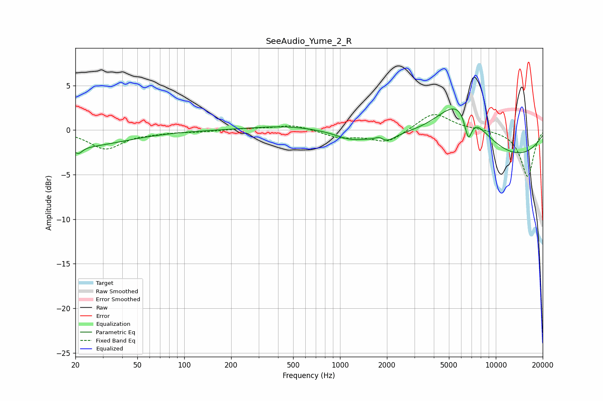

# SeeAudio_Yume_2_R
See [usage instructions](https://github.com/jaakkopasanen/AutoEq#usage) for more options and info.

### Parametric EQs
Apply preamp of -2.5 dB when using parametric equalizer.

|   # | Type    |   Fc (Hz) |    Q |   Gain (dB) |
|-----|---------|-----------|------|-------------|
|   1 | Peaking |        20 | 0.46 |        -1.9 |
|   2 | Peaking |        21 | 5.63 |        -0.5 |
|   3 | Peaking |        21 | 5.94 |        -0.2 |
|   4 | Peaking |       445 | 0.64 |         0.5 |
|   5 | Peaking |      1180 | 1.39 |        -1   |
|   6 | Peaking |      1793 | 4.86 |         0.7 |
|   7 | Peaking |      1911 | 2.33 |        -1.2 |
|   8 | Peaking |      5848 | 0.86 |         5.9 |
|   9 | Peaking |      6656 | 5.56 |        -2.9 |
|  10 | Peaking |     10000 | 0.28 |        -3.6 |

### Fixed Band EQs
When using fixed band (also called graphic) equalizer, apply preamp of **-1.8 dB** (if available) and set gains manually with these parameters.

|   # | Type    |   Fc (Hz) |    Q |   Gain (dB) |
|-----|---------|-----------|------|-------------|
|   1 | Peaking |        31 | 1.41 |        -2.1 |
|   2 | Peaking |        62 | 1.41 |        -0.2 |
|   3 | Peaking |       125 | 1.41 |        -0.2 |
|   4 | Peaking |       250 | 1.41 |         0.2 |
|   5 | Peaking |       500 | 1.41 |         0.6 |
|   6 | Peaking |      1000 | 1.41 |        -0.8 |
|   7 | Peaking |      2000 | 1.41 |        -1.4 |
|   8 | Peaking |      4000 | 1.41 |         2   |
|   9 | Peaking |      8000 | 1.41 |         0.1 |
|  10 | Peaking |     16000 | 1.41 |        -5.2 |

### Graphs

