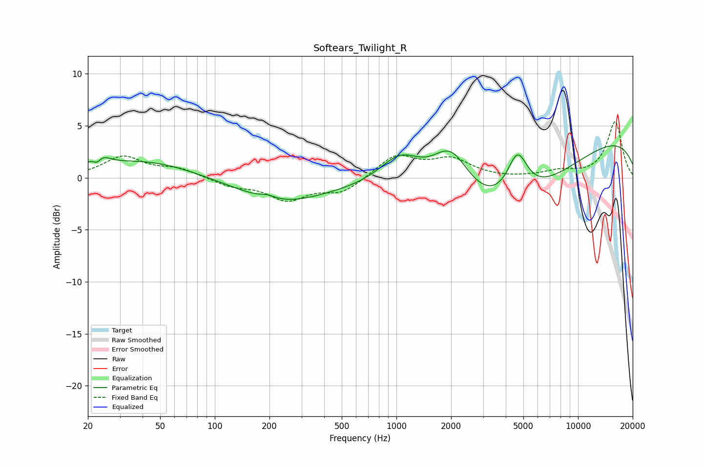

# Softears_Twilight_R
See [usage instructions](https://github.com/jaakkopasanen/AutoEq#usage) for more options and info.

### Parametric EQs
Apply preamp of -3.2 dB when using parametric equalizer.

|   # | Type    |   Fc (Hz) |    Q |   Gain (dB) |
|-----|---------|-----------|------|-------------|
|   1 | Peaking |        22 | 5.41 |        -1.4 |
|   2 | Peaking |        23 | 3.18 |         1.9 |
|   3 | Peaking |        41 | 0.53 |         1.6 |
|   4 | Peaking |       196 | 3.53 |         0.3 |
|   5 | Peaking |       232 | 0.58 |        -2.3 |
|   6 | Peaking |      1058 | 1.14 |         3.7 |
|   7 | Peaking |      1992 | 1.26 |         5.4 |
|   8 | Peaking |      3377 | 0.34 |        -7.1 |
|   9 | Peaking |      4639 | 2.51 |         4.1 |
|  10 | Peaking |     10000 | 0.2  |         4.4 |

### Fixed Band EQs
When using fixed band (also called graphic) equalizer, apply preamp of **-5.5 dB** (if available) and set gains manually with these parameters.

|   # | Type    |   Fc (Hz) |    Q |   Gain (dB) |
|-----|---------|-----------|------|-------------|
|   1 | Peaking |        31 | 1.41 |         2   |
|   2 | Peaking |        62 | 1.41 |         0.8 |
|   3 | Peaking |       125 | 1.41 |        -0.7 |
|   4 | Peaking |       250 | 1.41 |        -2   |
|   5 | Peaking |       500 | 1.41 |        -1.4 |
|   6 | Peaking |      1000 | 1.41 |         2.1 |
|   7 | Peaking |      2000 | 1.41 |         1.7 |
|   8 | Peaking |      4000 | 1.41 |        -0.1 |
|   9 | Peaking |      8000 | 1.41 |         0.6 |
|  10 | Peaking |     16000 | 1.41 |         5.4 |

### Graphs

