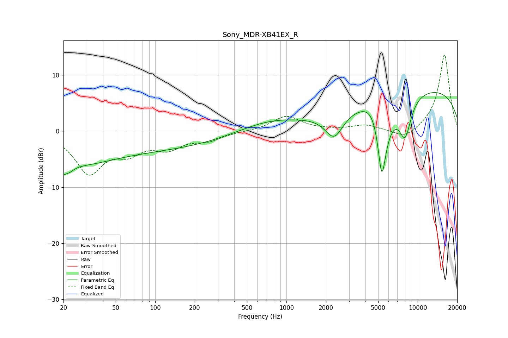

# Sony_MDR-XB41EX_R
See [usage instructions](https://github.com/jaakkopasanen/AutoEq#usage) for more options and info.

### Parametric EQs
Apply preamp of -7.0 dB when using parametric equalizer.

|   # | Type    |   Fc (Hz) |    Q |   Gain (dB) |
|-----|---------|-----------|------|-------------|
|   1 | Peaking |        21 | 3.99 |        -4.6 |
|   2 | Peaking |        21 | 5.78 |         2.2 |
|   3 | Peaking |        25 | 0.57 |        -2.9 |
|   4 | Peaking |        67 | 0.19 |        -3.3 |
|   5 | Peaking |       733 | 0.62 |         1.8 |
|   6 | Peaking |      2308 | 2.02 |        -4.6 |
|   7 | Peaking |      4912 | 1.53 |         7.3 |
|   8 | Peaking |      5327 | 2.54 |       -20   |
|   9 | Peaking |      8025 | 2.87 |        -6.5 |
|  10 | Peaking |     10000 | 0.2  |         7.9 |

### Fixed Band EQs
When using fixed band (also called graphic) equalizer, apply preamp of **-13.7 dB** (if available) and set gains manually with these parameters.

|   # | Type    |   Fc (Hz) |    Q |   Gain (dB) |
|-----|---------|-----------|------|-------------|
|   1 | Peaking |        31 | 1.41 |        -7.2 |
|   2 | Peaking |        62 | 1.41 |        -3   |
|   3 | Peaking |       125 | 1.41 |        -2.6 |
|   4 | Peaking |       250 | 1.41 |        -1.4 |
|   5 | Peaking |       500 | 1.41 |        -0   |
|   6 | Peaking |      1000 | 1.41 |         2.7 |
|   7 | Peaking |      2000 | 1.41 |         0.1 |
|   8 | Peaking |      4000 | 1.41 |         1   |
|   9 | Peaking |      8000 | 1.41 |        -1.6 |
|  10 | Peaking |     16000 | 1.41 |        13.7 |

### Graphs

