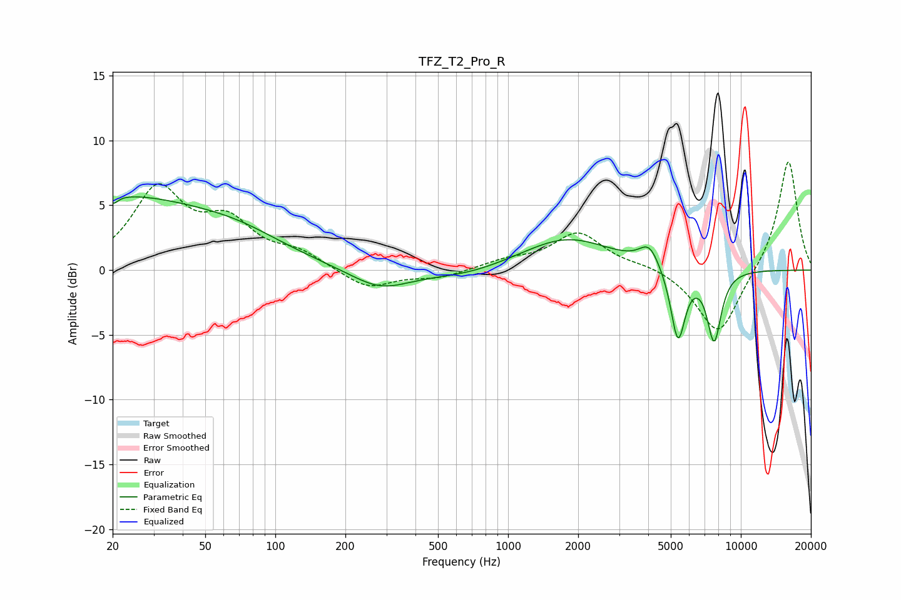

# TFZ_T2_Pro_R
See [usage instructions](https://github.com/jaakkopasanen/AutoEq#usage) for more options and info.

### Parametric EQs
Apply preamp of -5.7 dB when using parametric equalizer.

|   # | Type    |   Fc (Hz) |    Q |   Gain (dB) |
|-----|---------|-----------|------|-------------|
|   1 | Peaking |        20 | 0.33 |         5.5 |
|   2 | Peaking |        20 | 5.98 |        -3.8 |
|   3 | Peaking |        20 | 5.85 |         3.3 |
|   4 | Peaking |        71 | 0.7  |         1.3 |
|   5 | Peaking |       282 | 1.09 |        -1.6 |
|   6 | Peaking |       656 | 0.84 |        -0.6 |
|   7 | Peaking |      1791 | 0.73 |         2.5 |
|   8 | Peaking |      4045 | 3.23 |         1.6 |
|   9 | Peaking |      5370 | 4.42 |        -5.7 |
|  10 | Peaking |      7681 | 4.35 |        -5.4 |

### Fixed Band EQs
When using fixed band (also called graphic) equalizer, apply preamp of **-8.4 dB** (if available) and set gains manually with these parameters.

|   # | Type    |   Fc (Hz) |    Q |   Gain (dB) |
|-----|---------|-----------|------|-------------|
|   1 | Peaking |        31 | 1.41 |         6   |
|   2 | Peaking |        62 | 1.41 |         3.2 |
|   3 | Peaking |       125 | 1.41 |         1.2 |
|   4 | Peaking |       250 | 1.41 |        -1.5 |
|   5 | Peaking |       500 | 1.41 |        -0.6 |
|   6 | Peaking |      1000 | 1.41 |         0.6 |
|   7 | Peaking |      2000 | 1.41 |         2.8 |
|   8 | Peaking |      4000 | 1.41 |         0.4 |
|   9 | Peaking |      8000 | 1.41 |        -5.2 |
|  10 | Peaking |     16000 | 1.41 |         8.6 |

### Graphs

