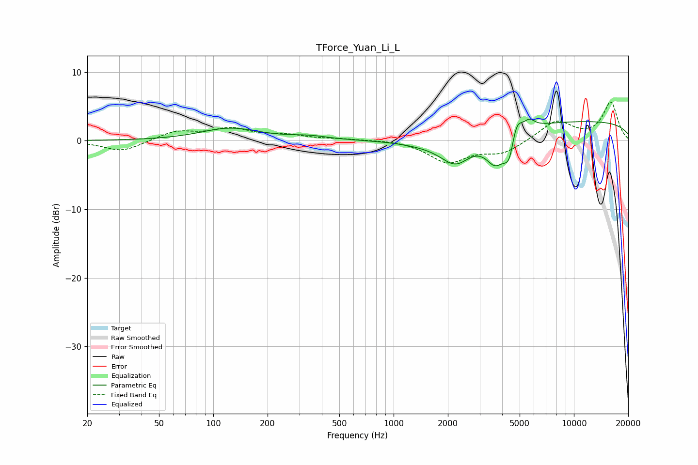

# TForce_Yuan_Li_L
See [usage instructions](https://github.com/jaakkopasanen/AutoEq#usage) for more options and info.

### Parametric EQs
Apply preamp of -3.2 dB when using parametric equalizer.

|   # | Type    |   Fc (Hz) |    Q |   Gain (dB) |
|-----|---------|-----------|------|-------------|
|   1 | Peaking |       124 | 0.87 |         1.8 |
|   2 | Peaking |       342 | 1.32 |         0.5 |
|   3 | Peaking |      1594 | 0.85 |        -0.9 |
|   4 | Peaking |      2213 | 1.67 |        -3.7 |
|   5 | Peaking |      3639 | 4.26 |        -0.4 |
|   6 | Peaking |      3670 | 2.36 |        -3.8 |
|   7 | Peaking |      4427 | 4.15 |        -5.5 |
|   8 | Peaking |      4725 | 4.01 |         4.6 |
|   9 | Peaking |      5677 | 4.96 |         1.1 |
|  10 | Peaking |     10000 | 0.18 |         2.9 |

### Fixed Band EQs
When using fixed band (also called graphic) equalizer, apply preamp of **-5.7 dB** (if available) and set gains manually with these parameters.

|   # | Type    |   Fc (Hz) |    Q |   Gain (dB) |
|-----|---------|-----------|------|-------------|
|   1 | Peaking |        31 | 1.41 |        -1.6 |
|   2 | Peaking |        62 | 1.41 |         1.3 |
|   3 | Peaking |       125 | 1.41 |         1.6 |
|   4 | Peaking |       250 | 1.41 |         0.7 |
|   5 | Peaking |       500 | 1.41 |         0.2 |
|   6 | Peaking |      1000 | 1.41 |         0.2 |
|   7 | Peaking |      2000 | 1.41 |        -3.1 |
|   8 | Peaking |      4000 | 1.41 |        -1.7 |
|   9 | Peaking |      8000 | 1.41 |         2.9 |
|  10 | Peaking |     16000 | 1.41 |         5.5 |

### Graphs

