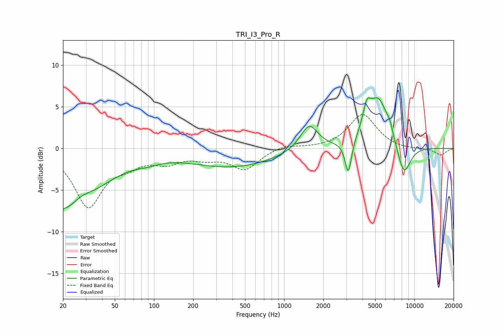

# TRI_I3_Pro_R
See [usage instructions](https://github.com/jaakkopasanen/AutoEq#usage) for more options and info.

### Parametric EQs
Apply preamp of -6.2 dB when using parametric equalizer.

|   # | Type    |   Fc (Hz) |    Q |   Gain (dB) |
|-----|---------|-----------|------|-------------|
|   1 | Peaking |        20 | 0.52 |        -7.6 |
|   2 | Peaking |        28 | 1.82 |         1.1 |
|   3 | Peaking |        89 | 1.63 |        -0.4 |
|   4 | Peaking |       402 | 0.43 |        -2.2 |
|   5 | Peaking |      1554 | 2.05 |         3.1 |
|   6 | Peaking |      3106 | 5.74 |        -4.1 |
|   7 | Peaking |      4308 | 4.56 |         2.6 |
|   8 | Peaking |      5294 | 1.74 |         5.9 |
|   9 | Peaking |      6484 | 6    |         0.9 |
|  10 | Peaking |      8296 | 2.5  |        -3.9 |

### Fixed Band EQs
When using fixed band (also called graphic) equalizer, apply preamp of **-4.2 dB** (if available) and set gains manually with these parameters.

|   # | Type    |   Fc (Hz) |    Q |   Gain (dB) |
|-----|---------|-----------|------|-------------|
|   1 | Peaking |        31 | 1.41 |        -6.8 |
|   2 | Peaking |        62 | 1.41 |        -1.4 |
|   3 | Peaking |       125 | 1.41 |        -1.4 |
|   4 | Peaking |       250 | 1.41 |        -0.9 |
|   5 | Peaking |       500 | 1.41 |        -2.4 |
|   6 | Peaking |      1000 | 1.41 |         0.5 |
|   7 | Peaking |      2000 | 1.41 |        -0   |
|   8 | Peaking |      4000 | 1.41 |         4.1 |
|   9 | Peaking |      8000 | 1.41 |        -0.2 |
|  10 | Peaking |     16000 | 1.41 |        -0.8 |

### Graphs

