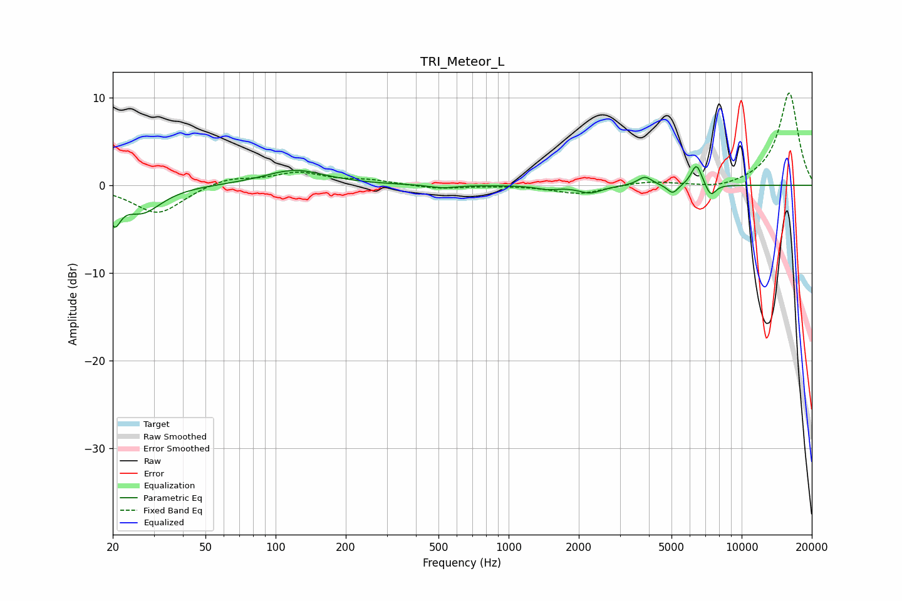

# TRI_Meteor_L
See [usage instructions](https://github.com/jaakkopasanen/AutoEq#usage) for more options and info.

### Parametric EQs
Apply preamp of -2.2 dB when using parametric equalizer.

|   # | Type    |   Fc (Hz) |    Q |   Gain (dB) |
|-----|---------|-----------|------|-------------|
|   1 | Peaking |        20 | 5.52 |        -3.2 |
|   2 | Peaking |        27 | 1.71 |        -3   |
|   3 | Peaking |       121 | 1.09 |         1.8 |
|   4 | Peaking |       522 | 2.59 |        -0.4 |
|   5 | Peaking |      1467 | 3.02 |        -0.4 |
|   6 | Peaking |      2237 | 2.81 |        -0.9 |
|   7 | Peaking |      3845 | 4.54 |         1   |
|   8 | Peaking |      5061 | 5.86 |        -1.1 |
|   9 | Peaking |      6402 | 5.89 |         2.5 |
|  10 | Peaking |      7366 | 6    |        -1.4 |

### Fixed Band EQs
When using fixed band (also called graphic) equalizer, apply preamp of **-10.6 dB** (if available) and set gains manually with these parameters.

|   # | Type    |   Fc (Hz) |    Q |   Gain (dB) |
|-----|---------|-----------|------|-------------|
|   1 | Peaking |        31 | 1.41 |        -3.3 |
|   2 | Peaking |        62 | 1.41 |         0.9 |
|   3 | Peaking |       125 | 1.41 |         1.4 |
|   4 | Peaking |       250 | 1.41 |         0.5 |
|   5 | Peaking |       500 | 1.41 |        -0.4 |
|   6 | Peaking |      1000 | 1.41 |        -0   |
|   7 | Peaking |      2000 | 1.41 |        -1   |
|   8 | Peaking |      4000 | 1.41 |         0.5 |
|   9 | Peaking |      8000 | 1.41 |        -0.5 |
|  10 | Peaking |     16000 | 1.41 |        10.6 |

### Graphs

