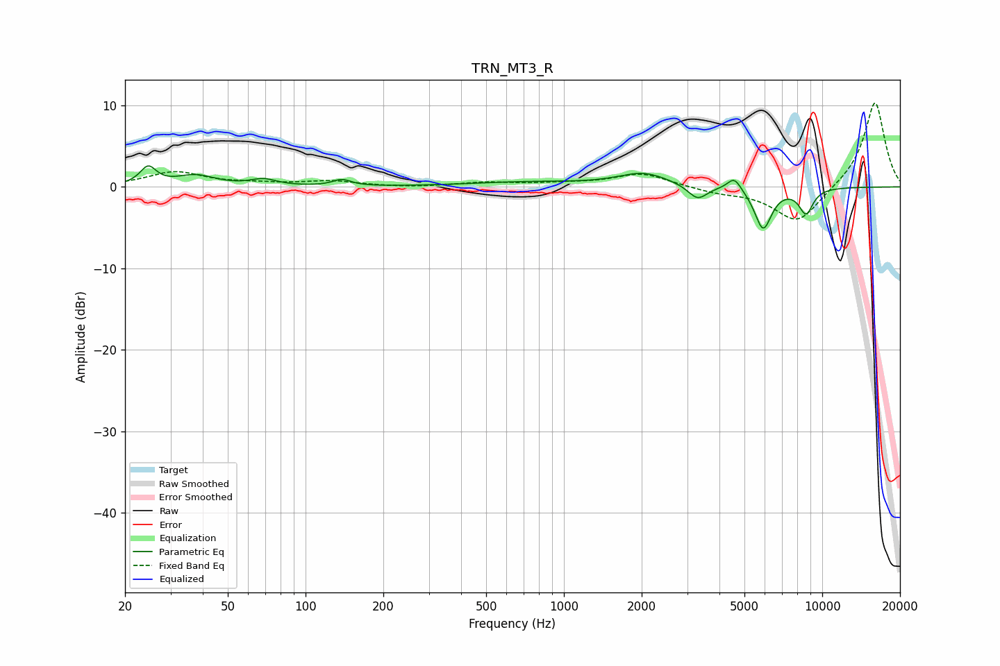

# TRN_MT3_R
See [usage instructions](https://github.com/jaakkopasanen/AutoEq#usage) for more options and info.

### Parametric EQs
Apply preamp of -2.7 dB when using parametric equalizer.

|   # | Type    |   Fc (Hz) |    Q |   Gain (dB) |
|-----|---------|-----------|------|-------------|
|   1 | Peaking |        25 | 4.61 |         2.2 |
|   2 | Peaking |        37 | 1.91 |         1.3 |
|   3 | Peaking |        69 | 2.89 |         0.8 |
|   4 | Peaking |       138 | 4.06 |         0.8 |
|   5 | Peaking |       719 | 0.63 |         0.6 |
|   6 | Peaking |      2030 | 1.45 |         1.6 |
|   7 | Peaking |      3292 | 3.76 |        -1.8 |
|   8 | Peaking |      4569 | 5.25 |         1.6 |
|   9 | Peaking |      5905 | 4.14 |        -5.1 |
|  10 | Peaking |      8655 | 4.69 |        -3.1 |

### Fixed Band EQs
When using fixed band (also called graphic) equalizer, apply preamp of **-10.4 dB** (if available) and set gains manually with these parameters.

|   # | Type    |   Fc (Hz) |    Q |   Gain (dB) |
|-----|---------|-----------|------|-------------|
|   1 | Peaking |        31 | 1.41 |         1.8 |
|   2 | Peaking |        62 | 1.41 |         0.3 |
|   3 | Peaking |       125 | 1.41 |         0.7 |
|   4 | Peaking |       250 | 1.41 |        -0.1 |
|   5 | Peaking |       500 | 1.41 |         0.5 |
|   6 | Peaking |      1000 | 1.41 |         0.3 |
|   7 | Peaking |      2000 | 1.41 |         1.7 |
|   8 | Peaking |      4000 | 1.41 |        -0.6 |
|   9 | Peaking |      8000 | 1.41 |        -4.5 |
|  10 | Peaking |     16000 | 1.41 |        10.6 |

### Graphs

