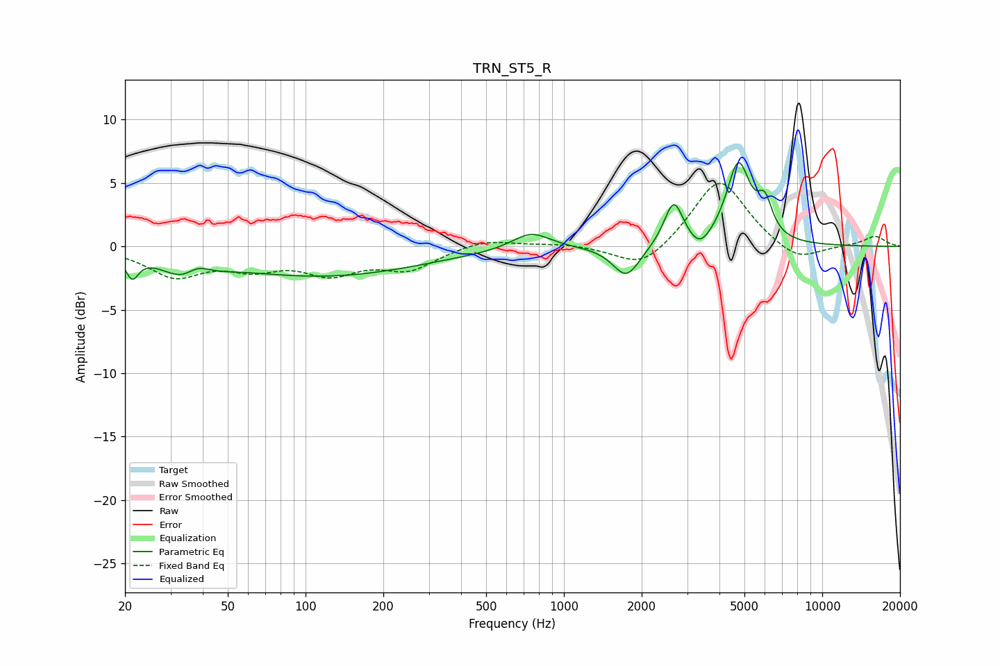

# TRN_ST5_R
See [usage instructions](https://github.com/jaakkopasanen/AutoEq#usage) for more options and info.

### Parametric EQs
Apply preamp of -6.7 dB when using parametric equalizer.

|   # | Type    |   Fc (Hz) |    Q |   Gain (dB) |
|-----|---------|-----------|------|-------------|
|   1 | Peaking |        21 | 5.95 |        -1.7 |
|   2 | Peaking |        35 | 1.67 |        -2.1 |
|   3 | Peaking |        38 | 2.86 |         1.3 |
|   4 | Peaking |       118 | 0.37 |        -2.3 |
|   5 | Peaking |       746 | 1.92 |         1.4 |
|   6 | Peaking |      1746 | 2.69 |        -2.5 |
|   7 | Peaking |      2661 | 3.88 |         3.5 |
|   8 | Peaking |      3360 | 3.48 |        -1.2 |
|   9 | Peaking |      4734 | 3.05 |         6.3 |
|  10 | Peaking |      5996 | 4.79 |         2.5 |

### Fixed Band EQs
When using fixed band (also called graphic) equalizer, apply preamp of **-5.1 dB** (if available) and set gains manually with these parameters.

|   # | Type    |   Fc (Hz) |    Q |   Gain (dB) |
|-----|---------|-----------|------|-------------|
|   1 | Peaking |        31 | 1.41 |        -2.2 |
|   2 | Peaking |        62 | 1.41 |        -1.4 |
|   3 | Peaking |       125 | 1.41 |        -1.9 |
|   4 | Peaking |       250 | 1.41 |        -1.7 |
|   5 | Peaking |       500 | 1.41 |         0.6 |
|   6 | Peaking |      1000 | 1.41 |         0.2 |
|   7 | Peaking |      2000 | 1.41 |        -1.9 |
|   8 | Peaking |      4000 | 1.41 |         5.5 |
|   9 | Peaking |      8000 | 1.41 |        -1.4 |
|  10 | Peaking |     16000 | 1.41 |         0.8 |

### Graphs

