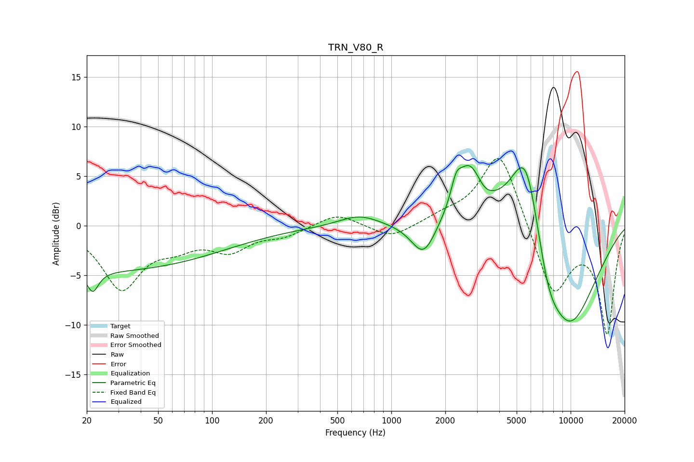

# TRN_V80_R
See [usage instructions](https://github.com/jaakkopasanen/AutoEq#usage) for more options and info.

### Parametric EQs
Apply preamp of -6.2 dB when using parametric equalizer.

|   # | Type    |   Fc (Hz) |    Q |   Gain (dB) |
|-----|---------|-----------|------|-------------|
|   1 | Peaking |        22 | 4.54 |        -2.1 |
|   2 | Peaking |        22 | 0.18 |        -4.6 |
|   3 | Peaking |       663 | 1.25 |         1.1 |
|   4 | Peaking |      1513 | 2.06 |        -3.5 |
|   5 | Peaking |      2299 | 4.92 |         2   |
|   6 | Peaking |      2720 | 1.91 |         5.6 |
|   7 | Peaking |      3306 | 3.31 |        -0.6 |
|   8 | Peaking |      5638 | 1.36 |        11.9 |
|   9 | Peaking |      7444 | 1.85 |        -3.9 |
|  10 | Peaking |      9719 | 0.71 |       -11   |

### Fixed Band EQs
When using fixed band (also called graphic) equalizer, apply preamp of **-6.9 dB** (if available) and set gains manually with these parameters.

|   # | Type    |   Fc (Hz) |    Q |   Gain (dB) |
|-----|---------|-----------|------|-------------|
|   1 | Peaking |        31 | 1.41 |        -6.2 |
|   2 | Peaking |        62 | 1.41 |        -1.5 |
|   3 | Peaking |       125 | 1.41 |        -2.2 |
|   4 | Peaking |       250 | 1.41 |        -0.9 |
|   5 | Peaking |       500 | 1.41 |         1.3 |
|   6 | Peaking |      1000 | 1.41 |        -1.3 |
|   7 | Peaking |      2000 | 1.41 |         0.8 |
|   8 | Peaking |      4000 | 1.41 |         7.9 |
|   9 | Peaking |      8000 | 1.41 |        -7.1 |
|  10 | Peaking |     16000 | 1.41 |       -10.7 |

### Graphs

