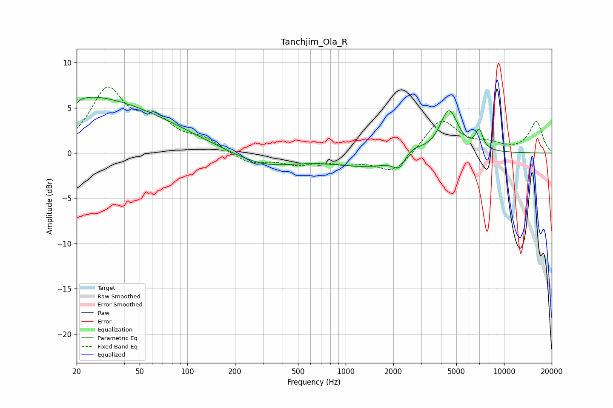

# Tanchjim_Ola_R
See [usage instructions](https://github.com/jaakkopasanen/AutoEq#usage) for more options and info.

### Parametric EQs
Apply preamp of -6.3 dB when using parametric equalizer.

|   # | Type    |   Fc (Hz) |    Q |   Gain (dB) |
|-----|---------|-----------|------|-------------|
|   1 | Peaking |        20 | 5.99 |        -3.6 |
|   2 | Peaking |        20 | 6    |         3.1 |
|   3 | Peaking |        20 | 0.71 |         1.4 |
|   4 | Peaking |        31 | 0.32 |         5.1 |
|   5 | Peaking |       306 | 0.72 |        -1.5 |
|   6 | Peaking |      1460 | 0.58 |        -1.5 |
|   7 | Peaking |      2178 | 3.95 |        -1.3 |
|   8 | Peaking |      2654 | 2.03 |         1.1 |
|   9 | Peaking |      4487 | 2.4  |         4.9 |
|  10 | Peaking |      6967 | 5.91 |         2.1 |

### Fixed Band EQs
When using fixed band (also called graphic) equalizer, apply preamp of **-7.4 dB** (if available) and set gains manually with these parameters.

|   # | Type    |   Fc (Hz) |    Q |   Gain (dB) |
|-----|---------|-----------|------|-------------|
|   1 | Peaking |        31 | 1.41 |         6.7 |
|   2 | Peaking |        62 | 1.41 |         3.1 |
|   3 | Peaking |       125 | 1.41 |         1.3 |
|   4 | Peaking |       250 | 1.41 |        -1.2 |
|   5 | Peaking |       500 | 1.41 |        -1.1 |
|   6 | Peaking |      1000 | 1.41 |        -0.9 |
|   7 | Peaking |      2000 | 1.41 |        -2.2 |
|   8 | Peaking |      4000 | 1.41 |         3.8 |
|   9 | Peaking |      8000 | 1.41 |         0.8 |
|  10 | Peaking |     16000 | 1.41 |         3.4 |

### Graphs

