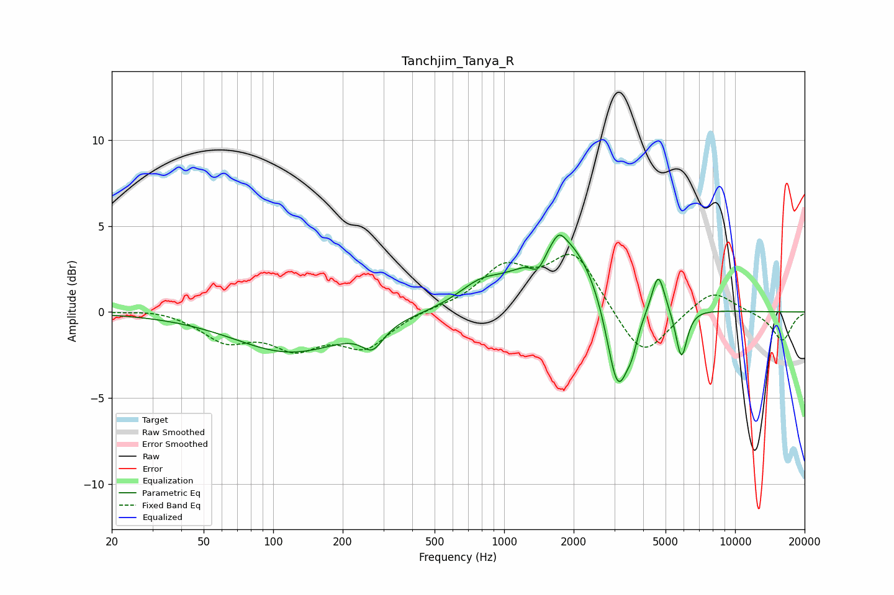

# Tanchjim_Tanya_R
See [usage instructions](https://github.com/jaakkopasanen/AutoEq#usage) for more options and info.

### Parametric EQs
Apply preamp of -4.6 dB when using parametric equalizer.

|   # | Type    |   Fc (Hz) |    Q |   Gain (dB) |
|-----|---------|-----------|------|-------------|
|   1 | Peaking |       119 | 0.58 |        -2.3 |
|   2 | Peaking |       270 | 3.05 |        -1.3 |
|   3 | Peaking |       786 | 1.51 |         1   |
|   4 | Peaking |      1405 | 4.51 |        -1.1 |
|   5 | Peaking |      1728 | 5.4  |         0.6 |
|   6 | Peaking |      1837 | 0.9  |         4.5 |
|   7 | Peaking |      3105 | 2.78 |        -6.1 |
|   8 | Peaking |      3584 | 6    |        -1   |
|   9 | Peaking |      4649 | 5.13 |         2.3 |
|  10 | Peaking |      5855 | 5.68 |        -3   |

### Fixed Band EQs
When using fixed band (also called graphic) equalizer, apply preamp of **-3.5 dB** (if available) and set gains manually with these parameters.

|   # | Type    |   Fc (Hz) |    Q |   Gain (dB) |
|-----|---------|-----------|------|-------------|
|   1 | Peaking |        31 | 1.41 |         0.2 |
|   2 | Peaking |        62 | 1.41 |        -1.5 |
|   3 | Peaking |       125 | 1.41 |        -1.8 |
|   4 | Peaking |       250 | 1.41 |        -1.9 |
|   5 | Peaking |       500 | 1.41 |         0.2 |
|   6 | Peaking |      1000 | 1.41 |         2.4 |
|   7 | Peaking |      2000 | 1.41 |         3.4 |
|   8 | Peaking |      4000 | 1.41 |        -2.9 |
|   9 | Peaking |      8000 | 1.41 |         1.4 |
|  10 | Peaking |     16000 | 1.41 |        -1.7 |

### Graphs

