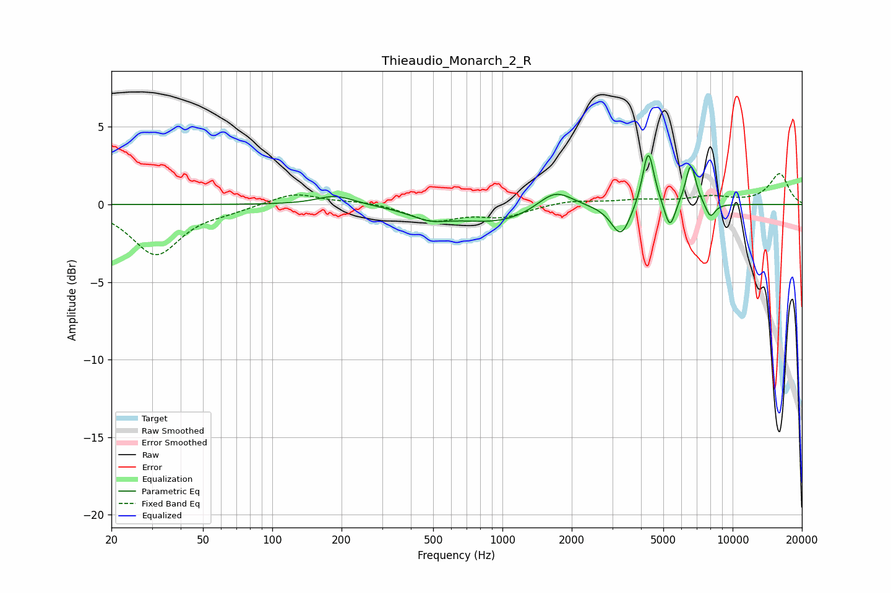

# Thieaudio_Monarch_2_R
See [usage instructions](https://github.com/jaakkopasanen/AutoEq#usage) for more options and info.

### Parametric EQs
Apply preamp of -3.3 dB when using parametric equalizer.

|   # | Type    |   Fc (Hz) |    Q |   Gain (dB) |
|-----|---------|-----------|------|-------------|
|   1 | Peaking |       188 | 1.75 |         0.6 |
|   2 | Peaking |       483 | 1.63 |        -0.6 |
|   3 | Peaking |       967 | 0.75 |        -1.2 |
|   4 | Peaking |      1692 | 1.81 |         1.4 |
|   5 | Peaking |      3274 | 3.35 |        -2.1 |
|   6 | Peaking |      4298 | 6    |         3.1 |
|   7 | Peaking |      4312 | 4.05 |         0.7 |
|   8 | Peaking |      5340 | 6    |        -1.8 |
|   9 | Peaking |      6580 | 5.94 |         2.7 |
|  10 | Peaking |      8002 | 6    |        -1   |

### Fixed Band EQs
When using fixed band (also called graphic) equalizer, apply preamp of **-2.1 dB** (if available) and set gains manually with these parameters.

|   # | Type    |   Fc (Hz) |    Q |   Gain (dB) |
|-----|---------|-----------|------|-------------|
|   1 | Peaking |        31 | 1.41 |        -3.2 |
|   2 | Peaking |        62 | 1.41 |        -0.3 |
|   3 | Peaking |       125 | 1.41 |         0.8 |
|   4 | Peaking |       250 | 1.41 |         0.2 |
|   5 | Peaking |       500 | 1.41 |        -1   |
|   6 | Peaking |      1000 | 1.41 |        -0.7 |
|   7 | Peaking |      2000 | 1.41 |         0.3 |
|   8 | Peaking |      4000 | 1.41 |         0.3 |
|   9 | Peaking |      8000 | 1.41 |         0.4 |
|  10 | Peaking |     16000 | 1.41 |         2   |

### Graphs

