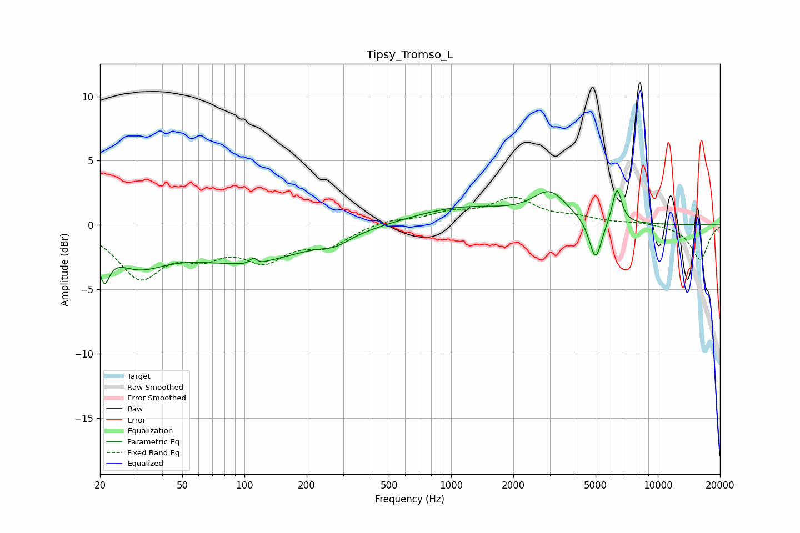

# Tipsy_Tromso_L
See [usage instructions](https://github.com/jaakkopasanen/AutoEq#usage) for more options and info.

### Parametric EQs
Apply preamp of -2.8 dB when using parametric equalizer.

|   # | Type    |   Fc (Hz) |    Q |   Gain (dB) |
|-----|---------|-----------|------|-------------|
|   1 | Peaking |        21 | 5.71 |        -2.5 |
|   2 | Peaking |        30 | 1.03 |        -2.4 |
|   3 | Peaking |       102 | 0.44 |        -2.7 |
|   4 | Peaking |       111 | 5.88 |         2.7 |
|   5 | Peaking |       111 | 5.08 |        -2.4 |
|   6 | Peaking |       275 | 2.13 |        -0.6 |
|   7 | Peaking |      1137 | 0.56 |         1.4 |
|   8 | Peaking |      2999 | 1.7  |         2.2 |
|   9 | Peaking |      4998 | 4.6  |        -3.3 |
|  10 | Peaking |      6346 | 6    |         2.8 |

### Fixed Band EQs
When using fixed band (also called graphic) equalizer, apply preamp of **-2.3 dB** (if available) and set gains manually with these parameters.

|   # | Type    |   Fc (Hz) |    Q |   Gain (dB) |
|-----|---------|-----------|------|-------------|
|   1 | Peaking |        31 | 1.41 |        -3.8 |
|   2 | Peaking |        62 | 1.41 |        -1.8 |
|   3 | Peaking |       125 | 1.41 |        -2.4 |
|   4 | Peaking |       250 | 1.41 |        -1.4 |
|   5 | Peaking |       500 | 1.41 |         0.4 |
|   6 | Peaking |      1000 | 1.41 |         0.8 |
|   7 | Peaking |      2000 | 1.41 |         1.9 |
|   8 | Peaking |      4000 | 1.41 |         0.5 |
|   9 | Peaking |      8000 | 1.41 |         0.2 |
|  10 | Peaking |     16000 | 1.41 |        -2.7 |

### Graphs

