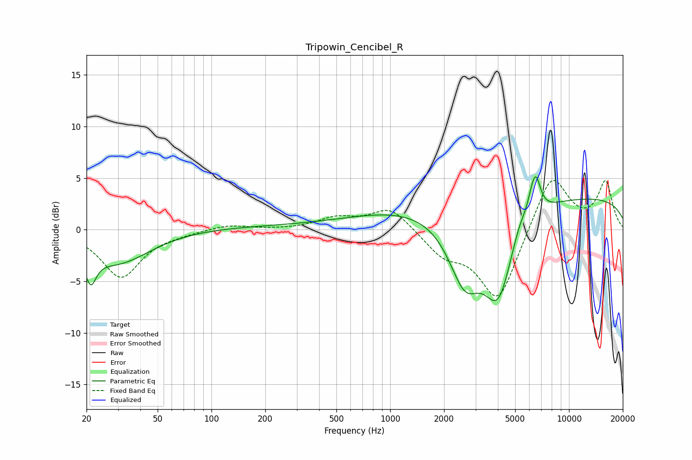

# Tripowin_Cencibel_R
See [usage instructions](https://github.com/jaakkopasanen/AutoEq#usage) for more options and info.

### Parametric EQs
Apply preamp of -5.2 dB when using parametric equalizer.

|   # | Type    |   Fc (Hz) |    Q |   Gain (dB) |
|-----|---------|-----------|------|-------------|
|   1 | Peaking |        21 | 4.77 |        -2.8 |
|   2 | Peaking |        29 | 0.74 |        -3.4 |
|   3 | Peaking |       152 | 0.19 |         0.3 |
|   4 | Peaking |      1173 | 0.47 |         1.5 |
|   5 | Peaking |      2616 | 1.53 |        -6.4 |
|   6 | Peaking |      4023 | 1.66 |        -8   |
|   7 | Peaking |      5303 | 2.98 |         1.4 |
|   8 | Peaking |      6191 | 5.75 |         1.1 |
|   9 | Peaking |      6544 | 5.08 |         3.1 |
|  10 | Peaking |     10000 | 0.18 |         3.2 |

### Fixed Band EQs
When using fixed band (also called graphic) equalizer, apply preamp of **-4.9 dB** (if available) and set gains manually with these parameters.

|   # | Type    |   Fc (Hz) |    Q |   Gain (dB) |
|-----|---------|-----------|------|-------------|
|   1 | Peaking |        31 | 1.41 |        -4.6 |
|   2 | Peaking |        62 | 1.41 |        -0.2 |
|   3 | Peaking |       125 | 1.41 |         0.5 |
|   4 | Peaking |       250 | 1.41 |        -0   |
|   5 | Peaking |       500 | 1.41 |         1   |
|   6 | Peaking |      1000 | 1.41 |         2.2 |
|   7 | Peaking |      2000 | 1.41 |        -2.2 |
|   8 | Peaking |      4000 | 1.41 |        -7   |
|   9 | Peaking |      8000 | 1.41 |         5.6 |
|  10 | Peaking |     16000 | 1.41 |         4.5 |

### Graphs

