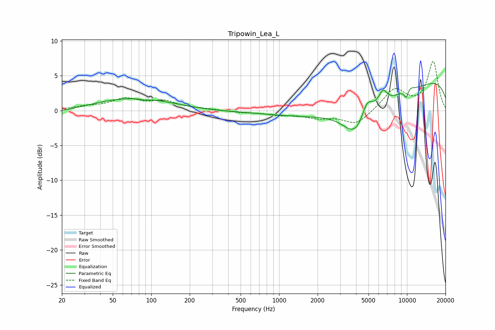

# Tripowin_Lea_L
See [usage instructions](https://github.com/jaakkopasanen/AutoEq#usage) for more options and info.

### Parametric EQs
Apply preamp of -4.0 dB when using parametric equalizer.

|   # | Type    |   Fc (Hz) |    Q |   Gain (dB) |
|-----|---------|-----------|------|-------------|
|   1 | Peaking |        52 | 0.18 |        -1.5 |
|   2 | Peaking |        71 | 0.37 |         3.2 |
|   3 | Peaking |        88 | 4.46 |        -0.2 |
|   4 | Peaking |      4005 | 1.4  |        -4.2 |
|   5 | Peaking |      4857 | 3.18 |         2.7 |
|   6 | Peaking |      4877 | 0.25 |        -4.2 |
|   7 | Peaking |      6484 | 4.18 |         1.9 |
|   8 | Peaking |      9823 | 0.18 |         6.1 |
|   9 | Peaking |      9893 | 5.46 |        -2.8 |
|  10 | Peaking |      9996 | 3.57 |         2.2 |

### Fixed Band EQs
When using fixed band (also called graphic) equalizer, apply preamp of **-7.1 dB** (if available) and set gains manually with these parameters.

|   # | Type    |   Fc (Hz) |    Q |   Gain (dB) |
|-----|---------|-----------|------|-------------|
|   1 | Peaking |        31 | 1.41 |         0.5 |
|   2 | Peaking |        62 | 1.41 |         1.5 |
|   3 | Peaking |       125 | 1.41 |         1.2 |
|   4 | Peaking |       250 | 1.41 |         0.2 |
|   5 | Peaking |       500 | 1.41 |        -0.2 |
|   6 | Peaking |      1000 | 1.41 |        -0.5 |
|   7 | Peaking |      2000 | 1.41 |        -0.9 |
|   8 | Peaking |      4000 | 1.41 |        -2   |
|   9 | Peaking |      8000 | 1.41 |         3.1 |
|  10 | Peaking |     16000 | 1.41 |         7   |

### Graphs

