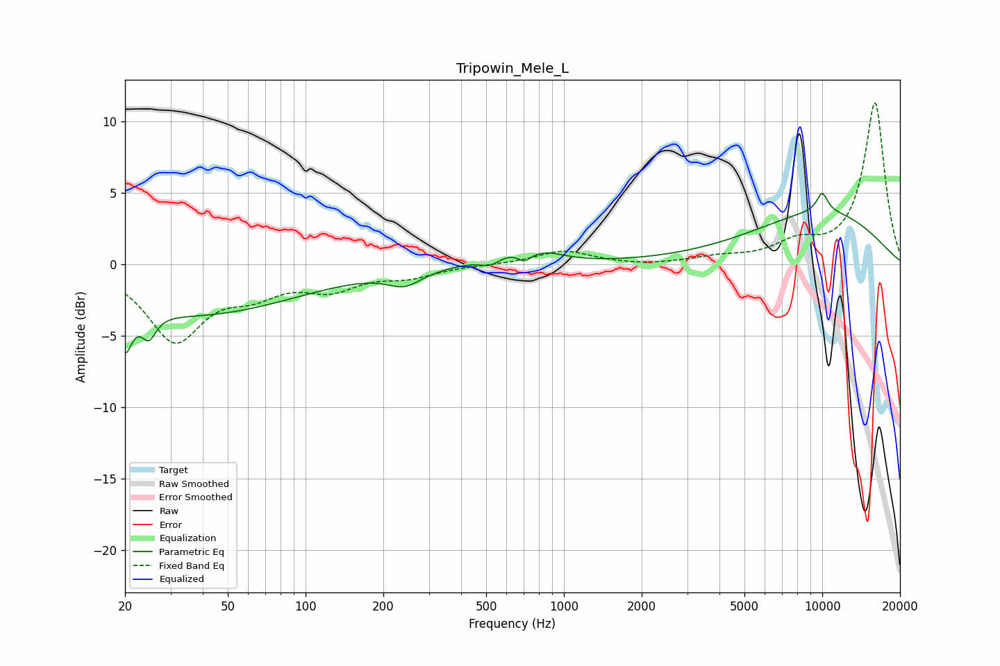

# Tripowin_Mele_L
See [usage instructions](https://github.com/jaakkopasanen/AutoEq#usage) for more options and info.

### Parametric EQs
Apply preamp of -5.1 dB when using parametric equalizer.

|   # | Type    |   Fc (Hz) |    Q |   Gain (dB) |
|-----|---------|-----------|------|-------------|
|   1 | Peaking |        20 | 5.47 |        -3   |
|   2 | Peaking |        25 | 5.1  |        -1.7 |
|   3 | Peaking |        37 | 0.35 |        -3.5 |
|   4 | Peaking |       242 | 2.12 |        -1   |
|   5 | Peaking |       519 | 3.78 |        -0.6 |
|   6 | Peaking |       616 | 1.29 |         0.8 |
|   7 | Peaking |       703 | 6    |        -0.6 |
|   8 | Peaking |       872 | 2.06 |         0.4 |
|   9 | Peaking |     10000 | 5.51 |         1.3 |
|  10 | Peaking |     10000 | 0.44 |         3.6 |

### Fixed Band EQs
When using fixed band (also called graphic) equalizer, apply preamp of **-11.4 dB** (if available) and set gains manually with these parameters.

|   # | Type    |   Fc (Hz) |    Q |   Gain (dB) |
|-----|---------|-----------|------|-------------|
|   1 | Peaking |        31 | 1.41 |        -5.2 |
|   2 | Peaking |        62 | 1.41 |        -1.6 |
|   3 | Peaking |       125 | 1.41 |        -1.5 |
|   4 | Peaking |       250 | 1.41 |        -0.7 |
|   5 | Peaking |       500 | 1.41 |        -0   |
|   6 | Peaking |      1000 | 1.41 |         1   |
|   7 | Peaking |      2000 | 1.41 |        -0.1 |
|   8 | Peaking |      4000 | 1.41 |         0.4 |
|   9 | Peaking |      8000 | 1.41 |         1.3 |
|  10 | Peaking |     16000 | 1.41 |        11.3 |

### Graphs

