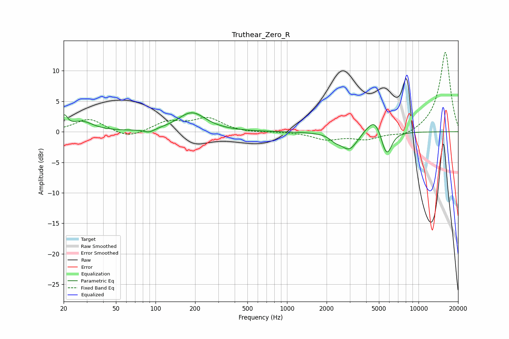

# Truthear_Zero_R
See [usage instructions](https://github.com/jaakkopasanen/AutoEq#usage) for more options and info.

### Parametric EQs
Apply preamp of -3.2 dB when using parametric equalizer.

|   # | Type    |   Fc (Hz) |    Q |   Gain (dB) |
|-----|---------|-----------|------|-------------|
|   1 | Peaking |        20 | 5.95 |         2   |
|   2 | Peaking |        28 | 1.74 |         1.6 |
|   3 | Peaking |        89 | 3.57 |        -0.6 |
|   4 | Peaking |       189 | 1.35 |         3.1 |
|   5 | Peaking |      2328 | 3.67 |        -0.7 |
|   6 | Peaking |      2968 | 2.25 |        -2.9 |
|   7 | Peaking |      4015 | 3.38 |         0.5 |
|   8 | Peaking |      4633 | 2.96 |         2.2 |
|   9 | Peaking |      5460 | 5.69 |        -0.9 |
|  10 | Peaking |      5823 | 3.87 |        -3.3 |

### Fixed Band EQs
When using fixed band (also called graphic) equalizer, apply preamp of **-13.1 dB** (if available) and set gains manually with these parameters.

|   # | Type    |   Fc (Hz) |    Q |   Gain (dB) |
|-----|---------|-----------|------|-------------|
|   1 | Peaking |        31 | 1.41 |         2.1 |
|   2 | Peaking |        62 | 1.41 |        -1.2 |
|   3 | Peaking |       125 | 1.41 |         1.6 |
|   4 | Peaking |       250 | 1.41 |         2.1 |
|   5 | Peaking |       500 | 1.41 |        -0.2 |
|   6 | Peaking |      1000 | 1.41 |         0   |
|   7 | Peaking |      2000 | 1.41 |        -1.2 |
|   8 | Peaking |      4000 | 1.41 |        -1.2 |
|   9 | Peaking |      8000 | 1.41 |        -0.9 |
|  10 | Peaking |     16000 | 1.41 |        13.1 |

### Graphs

