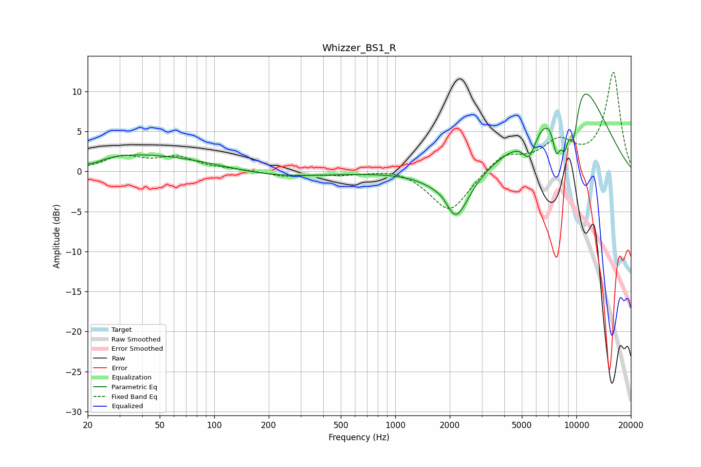

# Whizzer_BS1_R
See [usage instructions](https://github.com/jaakkopasanen/AutoEq#usage) for more options and info.

### Parametric EQs
Apply preamp of -9.8 dB when using parametric equalizer.

|   # | Type    |   Fc (Hz) |    Q |   Gain (dB) |
|-----|---------|-----------|------|-------------|
|   1 | Peaking |        20 | 1.78 |        -1.5 |
|   2 | Peaking |        29 | 0.18 |         2.5 |
|   3 | Peaking |       178 | 0.47 |        -1.3 |
|   4 | Peaking |      1901 | 2.48 |         2.2 |
|   5 | Peaking |      2108 | 1.78 |        -8.1 |
|   6 | Peaking |      5491 | 3.83 |        -3   |
|   7 | Peaking |      7766 | 5.64 |        -5   |
|   8 | Peaking |      8600 | 5.46 |        -4.9 |
|   9 | Peaking |      9637 | 4.4  |        -6.6 |
|  10 | Peaking |      9853 | 0.69 |        12.7 |

### Fixed Band EQs
When using fixed band (also called graphic) equalizer, apply preamp of **-12.5 dB** (if available) and set gains manually with these parameters.

|   # | Type    |   Fc (Hz) |    Q |   Gain (dB) |
|-----|---------|-----------|------|-------------|
|   1 | Peaking |        31 | 1.41 |         1.7 |
|   2 | Peaking |        62 | 1.41 |         1.6 |
|   3 | Peaking |       125 | 1.41 |         0.2 |
|   4 | Peaking |       250 | 1.41 |        -0.6 |
|   5 | Peaking |       500 | 1.41 |        -0.4 |
|   6 | Peaking |      1000 | 1.41 |         0.5 |
|   7 | Peaking |      2000 | 1.41 |        -5.2 |
|   8 | Peaking |      4000 | 1.41 |         2.2 |
|   9 | Peaking |      8000 | 1.41 |         3.3 |
|  10 | Peaking |     16000 | 1.41 |        12.3 |

### Graphs

