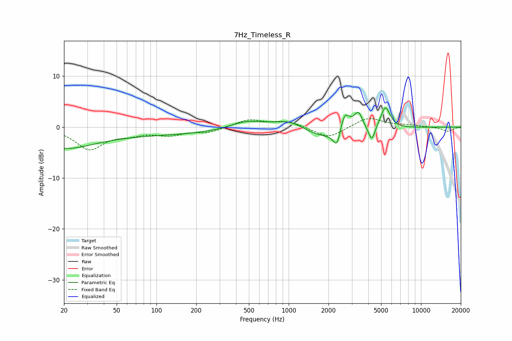

# 7Hz_Timeless_R
See [usage instructions](https://github.com/jaakkopasanen/AutoEq#usage) for more options and info.

### Parametric EQs
Apply preamp of -3.9 dB when using parametric equalizer.

|   # | Type    |   Fc (Hz) |    Q |   Gain (dB) |
|-----|---------|-----------|------|-------------|
|   1 | Peaking |        20 | 0.68 |        -3   |
|   2 | Peaking |        70 | 0.18 |        -1.5 |
|   3 | Peaking |       472 | 1.19 |         1.5 |
|   4 | Peaking |      1023 | 1.04 |         2.1 |
|   5 | Peaking |      1963 | 0.71 |        -2.9 |
|   6 | Peaking |      2328 | 5.15 |        -4   |
|   7 | Peaking |      2629 | 3.21 |         5   |
|   8 | Peaking |      3366 | 4.48 |         3.3 |
|   9 | Peaking |      4245 | 6    |        -2.9 |
|  10 | Peaking |      5381 | 3.9  |         4.4 |

### Fixed Band EQs
When using fixed band (also called graphic) equalizer, apply preamp of **-1.8 dB** (if available) and set gains manually with these parameters.

|   # | Type    |   Fc (Hz) |    Q |   Gain (dB) |
|-----|---------|-----------|------|-------------|
|   1 | Peaking |        31 | 1.41 |        -4.2 |
|   2 | Peaking |        62 | 1.41 |        -1.1 |
|   3 | Peaking |       125 | 1.41 |        -1.3 |
|   4 | Peaking |       250 | 1.41 |        -1   |
|   5 | Peaking |       500 | 1.41 |         1.5 |
|   6 | Peaking |      1000 | 1.41 |         1.1 |
|   7 | Peaking |      2000 | 1.41 |        -2.3 |
|   8 | Peaking |      4000 | 1.41 |         1.9 |
|   9 | Peaking |      8000 | 1.41 |         0.3 |
|  10 | Peaking |     16000 | 1.41 |        -0.8 |

### Graphs

