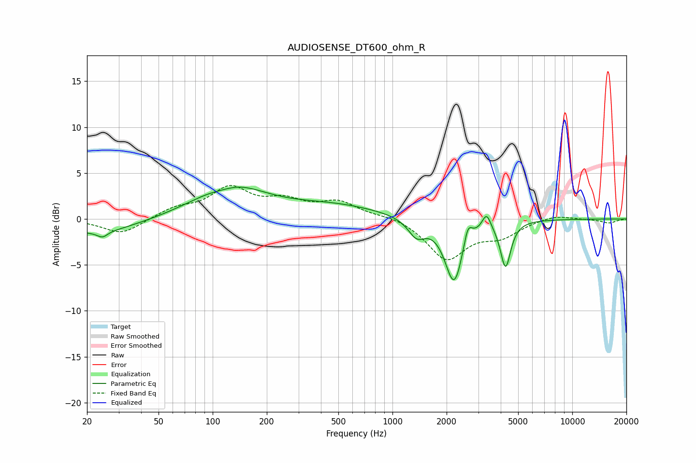

# AUDIOSENSE_DT600_ohm_R
See [usage instructions](https://github.com/jaakkopasanen/AutoEq#usage) for more options and info.

### Parametric EQs
Apply preamp of -3.6 dB when using parametric equalizer.

|   # | Type    |   Fc (Hz) |    Q |   Gain (dB) |
|-----|---------|-----------|------|-------------|
|   1 | Peaking |        22 | 0.63 |        -1.6 |
|   2 | Peaking |        24 | 5.22 |        -0.6 |
|   3 | Peaking |       114 | 1.56 |        -0.7 |
|   4 | Peaking |       123 | 0.76 |         3.8 |
|   5 | Peaking |       471 | 0.52 |         1.4 |
|   6 | Peaking |      1362 | 2.99 |        -1.9 |
|   7 | Peaking |      2204 | 2.79 |        -7   |
|   8 | Peaking |      2623 | 6    |         2.2 |
|   9 | Peaking |      3335 | 5.99 |         1.7 |
|  10 | Peaking |      4256 | 5.02 |        -5   |

### Fixed Band EQs
When using fixed band (also called graphic) equalizer, apply preamp of **-3.7 dB** (if available) and set gains manually with these parameters.

|   # | Type    |   Fc (Hz) |    Q |   Gain (dB) |
|-----|---------|-----------|------|-------------|
|   1 | Peaking |        31 | 1.41 |        -1.7 |
|   2 | Peaking |        62 | 1.41 |         1   |
|   3 | Peaking |       125 | 1.41 |         3.2 |
|   4 | Peaking |       250 | 1.41 |         1.7 |
|   5 | Peaking |       500 | 1.41 |         1.7 |
|   6 | Peaking |      1000 | 1.41 |         0.4 |
|   7 | Peaking |      2000 | 1.41 |        -4.3 |
|   8 | Peaking |      4000 | 1.41 |        -1.6 |
|   9 | Peaking |      8000 | 1.41 |         0.5 |
|  10 | Peaking |     16000 | 1.41 |        -0.4 |

### Graphs

