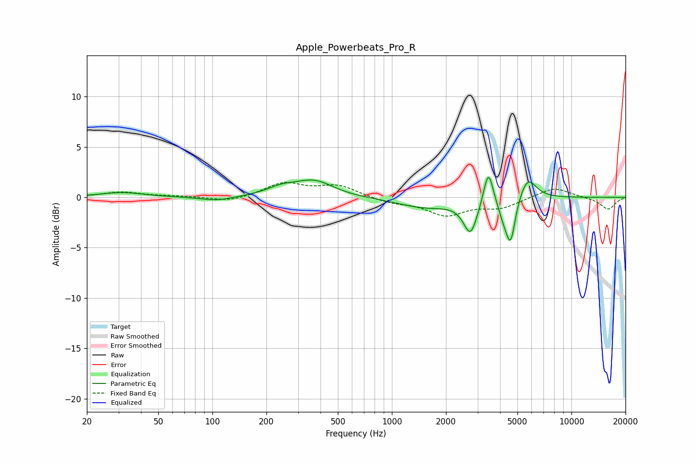

# Apple_Powerbeats_Pro_R
See [usage instructions](https://github.com/jaakkopasanen/AutoEq#usage) for more options and info.

### Parametric EQs
Apply preamp of -2.1 dB when using parametric equalizer.

|   # | Type    |   Fc (Hz) |    Q |   Gain (dB) |
|-----|---------|-----------|------|-------------|
|   1 | Peaking |        31 | 1.2  |         0.5 |
|   2 | Peaking |       105 | 1.58 |        -0.4 |
|   3 | Peaking |       244 | 1.66 |         0.7 |
|   4 | Peaking |       371 | 1.34 |         1.5 |
|   5 | Peaking |      1544 | 0.87 |        -1   |
|   6 | Peaking |      2740 | 3.67 |        -3.3 |
|   7 | Peaking |      3448 | 5.25 |         3.6 |
|   8 | Peaking |      4205 | 4.18 |        -1.6 |
|   9 | Peaking |      4591 | 5.54 |        -4   |
|  10 | Peaking |      5706 | 2.98 |         2.2 |

### Fixed Band EQs
When using fixed band (also called graphic) equalizer, apply preamp of **-1.6 dB** (if available) and set gains manually with these parameters.

|   # | Type    |   Fc (Hz) |    Q |   Gain (dB) |
|-----|---------|-----------|------|-------------|
|   1 | Peaking |        31 | 1.41 |         0.5 |
|   2 | Peaking |        62 | 1.41 |         0.1 |
|   3 | Peaking |       125 | 1.41 |        -0.5 |
|   4 | Peaking |       250 | 1.41 |         1.4 |
|   5 | Peaking |       500 | 1.41 |         1.1 |
|   6 | Peaking |      1000 | 1.41 |        -0.5 |
|   7 | Peaking |      2000 | 1.41 |        -1.7 |
|   8 | Peaking |      4000 | 1.41 |        -1   |
|   9 | Peaking |      8000 | 1.41 |         1   |
|  10 | Peaking |     16000 | 1.41 |        -1.2 |

### Graphs

