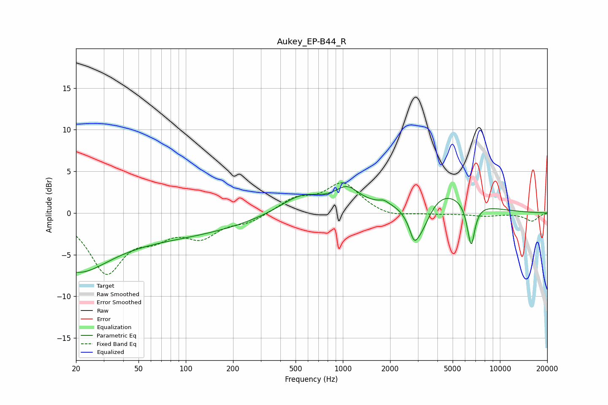

# Aukey_EP-B44_R
See [usage instructions](https://github.com/jaakkopasanen/AutoEq#usage) for more options and info.

### Parametric EQs
Apply preamp of -3.3 dB when using parametric equalizer.

|   # | Type    |   Fc (Hz) |    Q |   Gain (dB) |
|-----|---------|-----------|------|-------------|
|   1 | Peaking |        20 | 0.74 |        -4.4 |
|   2 | Peaking |        44 | 0.18 |        -3   |
|   3 | Peaking |       547 | 1.01 |         2.2 |
|   4 | Peaking |      1063 | 1.88 |         2.2 |
|   5 | Peaking |      1827 | 5.51 |         0.3 |
|   6 | Peaking |      2836 | 5.88 |        -1.5 |
|   7 | Peaking |      3060 | 1.84 |        -6.1 |
|   8 | Peaking |      3618 | 0.73 |         4.3 |
|   9 | Peaking |      6589 | 5.46 |        -7.2 |
|  10 | Peaking |      6683 | 5.86 |         1.9 |

### Fixed Band EQs
When using fixed band (also called graphic) equalizer, apply preamp of **-3.7 dB** (if available) and set gains manually with these parameters.

|   # | Type    |   Fc (Hz) |    Q |   Gain (dB) |
|-----|---------|-----------|------|-------------|
|   1 | Peaking |        31 | 1.41 |        -6.9 |
|   2 | Peaking |        62 | 1.41 |        -2.1 |
|   3 | Peaking |       125 | 1.41 |        -2.5 |
|   4 | Peaking |       250 | 1.41 |        -1   |
|   5 | Peaking |       500 | 1.41 |         1.6 |
|   6 | Peaking |      1000 | 1.41 |         3.5 |
|   7 | Peaking |      2000 | 1.41 |        -0.6 |
|   8 | Peaking |      4000 | 1.41 |        -0.1 |
|   9 | Peaking |      8000 | 1.41 |        -0.3 |
|  10 | Peaking |     16000 | 1.41 |        -1   |

### Graphs

