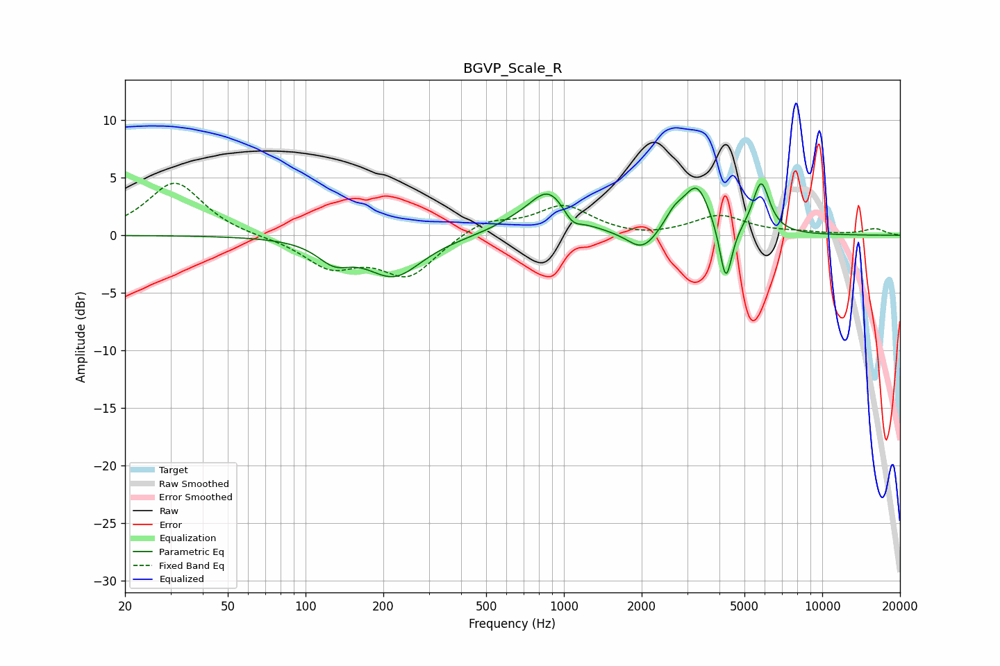

# BGVP_Scale_R
See [usage instructions](https://github.com/jaakkopasanen/AutoEq#usage) for more options and info.

### Parametric EQs
Apply preamp of -4.6 dB when using parametric equalizer.

|   # | Type    |   Fc (Hz) |    Q |   Gain (dB) |
|-----|---------|-----------|------|-------------|
|   1 | Peaking |       129 | 2.17 |        -1.7 |
|   2 | Peaking |       220 | 1.32 |        -3.5 |
|   3 | Peaking |       627 | 1.56 |         0.5 |
|   4 | Peaking |       875 | 1.79 |         3.8 |
|   5 | Peaking |      1075 | 4.04 |        -1.1 |
|   6 | Peaking |      2012 | 2.47 |        -1.8 |
|   7 | Peaking |      2677 | 3.65 |         1.3 |
|   8 | Peaking |      3274 | 2.75 |         4.1 |
|   9 | Peaking |      4236 | 5.94 |        -5.2 |
|  10 | Peaking |      5799 | 4.22 |         4.5 |

### Fixed Band EQs
When using fixed band (also called graphic) equalizer, apply preamp of **-4.6 dB** (if available) and set gains manually with these parameters.

|   # | Type    |   Fc (Hz) |    Q |   Gain (dB) |
|-----|---------|-----------|------|-------------|
|   1 | Peaking |        31 | 1.41 |         4.7 |
|   2 | Peaking |        62 | 1.41 |        -0.1 |
|   3 | Peaking |       125 | 1.41 |        -2.6 |
|   4 | Peaking |       250 | 1.41 |        -3.5 |
|   5 | Peaking |       500 | 1.41 |         1.3 |
|   6 | Peaking |      1000 | 1.41 |         2.5 |
|   7 | Peaking |      2000 | 1.41 |        -0.3 |
|   8 | Peaking |      4000 | 1.41 |         1.7 |
|   9 | Peaking |      8000 | 1.41 |         0.2 |
|  10 | Peaking |     16000 | 1.41 |         0.6 |

### Graphs

