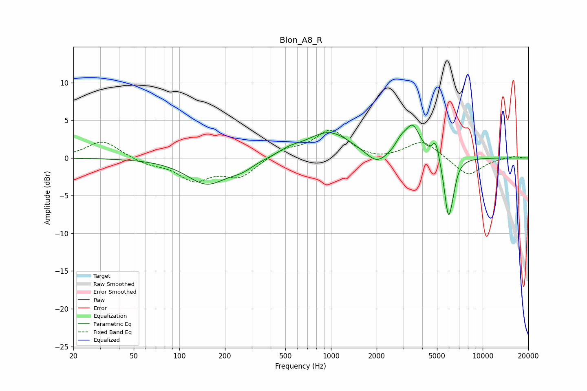

# Blon_A8_R
See [usage instructions](https://github.com/jaakkopasanen/AutoEq#usage) for more options and info.

### Parametric EQs
Apply preamp of -4.4 dB when using parametric equalizer.

|   # | Type    |   Fc (Hz) |    Q |   Gain (dB) |
|-----|---------|-----------|------|-------------|
|   1 | Peaking |       152 | 1.07 |        -3.4 |
|   2 | Peaking |       258 | 1.76 |        -0.9 |
|   3 | Peaking |       532 | 2.05 |         0.6 |
|   4 | Peaking |       968 | 0.95 |         3.5 |
|   5 | Peaking |      1998 | 2.07 |        -1.7 |
|   6 | Peaking |      2888 | 3.68 |         1.3 |
|   7 | Peaking |      3458 | 2.83 |         3.9 |
|   8 | Peaking |      4904 | 6    |         2.5 |
|   9 | Peaking |      5940 | 5.06 |        -7.5 |
|  10 | Peaking |      6370 | 6    |        -1.4 |

### Fixed Band EQs
When using fixed band (also called graphic) equalizer, apply preamp of **-3.8 dB** (if available) and set gains manually with these parameters.

|   # | Type    |   Fc (Hz) |    Q |   Gain (dB) |
|-----|---------|-----------|------|-------------|
|   1 | Peaking |        31 | 1.41 |         2.3 |
|   2 | Peaking |        62 | 1.41 |        -0.7 |
|   3 | Peaking |       125 | 1.41 |        -2.7 |
|   4 | Peaking |       250 | 1.41 |        -2.4 |
|   5 | Peaking |       500 | 1.41 |         1.1 |
|   6 | Peaking |      1000 | 1.41 |         3.6 |
|   7 | Peaking |      2000 | 1.41 |        -0.5 |
|   8 | Peaking |      4000 | 1.41 |         2.3 |
|   9 | Peaking |      8000 | 1.41 |        -2.4 |
|  10 | Peaking |     16000 | 1.41 |         0.3 |

### Graphs

