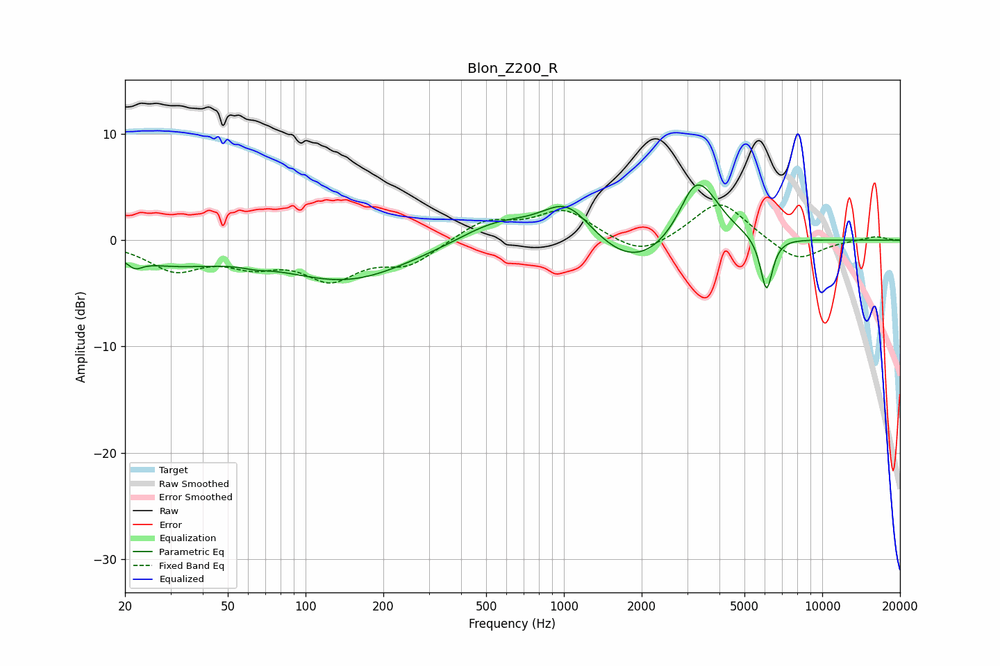

# Blon_Z200_R
See [usage instructions](https://github.com/jaakkopasanen/AutoEq#usage) for more options and info.

### Parametric EQs
Apply preamp of -5.3 dB when using parametric equalizer.

|   # | Type    |   Fc (Hz) |    Q |   Gain (dB) |
|-----|---------|-----------|------|-------------|
|   1 | Peaking |        22 | 5.04 |        -0.8 |
|   2 | Peaking |        30 | 0.71 |        -1.9 |
|   3 | Peaking |        64 | 2.9  |        -0.3 |
|   4 | Peaking |       145 | 0.57 |        -3.7 |
|   5 | Peaking |       545 | 0.97 |         1.9 |
|   6 | Peaking |      1029 | 1.42 |         3.8 |
|   7 | Peaking |      1883 | 0.89 |        -3.1 |
|   8 | Peaking |      3131 | 3.03 |         1.5 |
|   9 | Peaking |      3398 | 1.72 |         5.2 |
|  10 | Peaking |      6085 | 5.85 |        -5.1 |

### Fixed Band EQs
When using fixed band (also called graphic) equalizer, apply preamp of **-3.4 dB** (if available) and set gains manually with these parameters.

|   # | Type    |   Fc (Hz) |    Q |   Gain (dB) |
|-----|---------|-----------|------|-------------|
|   1 | Peaking |        31 | 1.41 |        -2.6 |
|   2 | Peaking |        62 | 1.41 |        -1.8 |
|   3 | Peaking |       125 | 1.41 |        -3.3 |
|   4 | Peaking |       250 | 1.41 |        -2.1 |
|   5 | Peaking |       500 | 1.41 |         1.9 |
|   6 | Peaking |      1000 | 1.41 |         2.7 |
|   7 | Peaking |      2000 | 1.41 |        -1.7 |
|   8 | Peaking |      4000 | 1.41 |         3.8 |
|   9 | Peaking |      8000 | 1.41 |        -2.1 |
|  10 | Peaking |     16000 | 1.41 |         0.4 |

### Graphs

