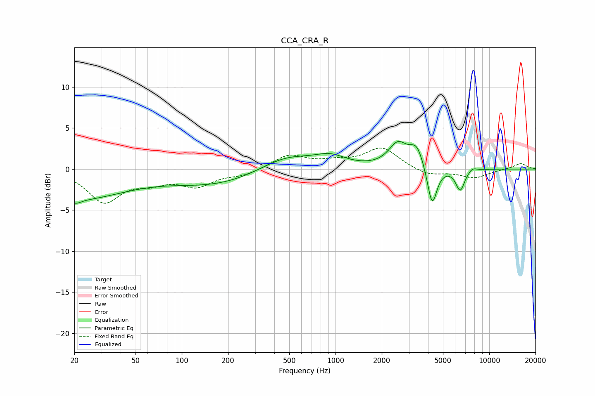

# CCA_CRA_R
See [usage instructions](https://github.com/jaakkopasanen/AutoEq#usage) for more options and info.

### Parametric EQs
Apply preamp of -3.5 dB when using parametric equalizer.

|   # | Type    |   Fc (Hz) |    Q |   Gain (dB) |
|-----|---------|-----------|------|-------------|
|   1 | Peaking |        20 | 0.42 |        -3.6 |
|   2 | Peaking |        20 | 4.17 |        -0.5 |
|   3 | Peaking |       169 | 0.49 |        -1.8 |
|   4 | Peaking |       475 | 0.82 |         1.8 |
|   5 | Peaking |       923 | 1.39 |         1.3 |
|   6 | Peaking |      2544 | 2.34 |         2.8 |
|   7 | Peaking |      3376 | 3.04 |         2.5 |
|   8 | Peaking |      4252 | 4.52 |        -4.9 |
|   9 | Peaking |      6475 | 4.71 |        -2.6 |
|  10 | Peaking |      7789 | 5.12 |         0.4 |

### Fixed Band EQs
When using fixed band (also called graphic) equalizer, apply preamp of **-2.7 dB** (if available) and set gains manually with these parameters.

|   # | Type    |   Fc (Hz) |    Q |   Gain (dB) |
|-----|---------|-----------|------|-------------|
|   1 | Peaking |        31 | 1.41 |        -3.9 |
|   2 | Peaking |        62 | 1.41 |        -1.3 |
|   3 | Peaking |       125 | 1.41 |        -1.9 |
|   4 | Peaking |       250 | 1.41 |        -0.7 |
|   5 | Peaking |       500 | 1.41 |         1.7 |
|   6 | Peaking |      1000 | 1.41 |         0.7 |
|   7 | Peaking |      2000 | 1.41 |         2.5 |
|   8 | Peaking |      4000 | 1.41 |        -0.8 |
|   9 | Peaking |      8000 | 1.41 |        -1.1 |
|  10 | Peaking |     16000 | 1.41 |         0.7 |

### Graphs

