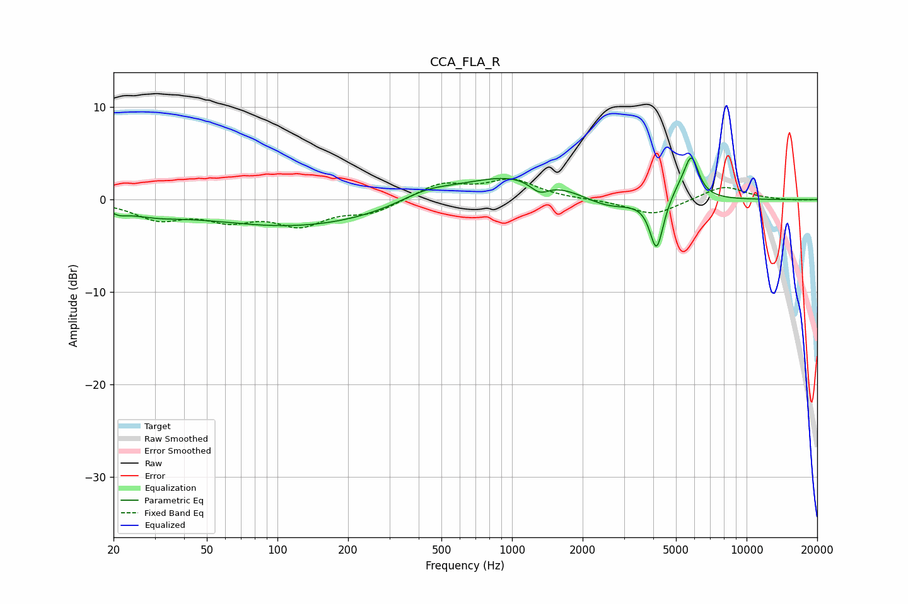

# CCA_FLA_R
See [usage instructions](https://github.com/jaakkopasanen/AutoEq#usage) for more options and info.

### Parametric EQs
Apply preamp of -4.6 dB when using parametric equalizer.

|   # | Type    |   Fc (Hz) |    Q |   Gain (dB) |
|-----|---------|-----------|------|-------------|
|   1 | Peaking |        21 | 4.45 |        -0.5 |
|   2 | Peaking |        29 | 1.05 |        -1   |
|   3 | Peaking |       122 | 0.36 |        -2.9 |
|   4 | Peaking |       428 | 1.23 |         1.1 |
|   5 | Peaking |      1039 | 0.58 |         2.9 |
|   6 | Peaking |      1310 | 3.37 |        -1.3 |
|   7 | Peaking |      2548 | 1.2  |        -1.6 |
|   8 | Peaking |      4134 | 4.93 |        -5.6 |
|   9 | Peaking |      5173 | 2.9  |         1.1 |
|  10 | Peaking |      5820 | 4.47 |         4.2 |

### Fixed Band EQs
When using fixed band (also called graphic) equalizer, apply preamp of **-2.3 dB** (if available) and set gains manually with these parameters.

|   # | Type    |   Fc (Hz) |    Q |   Gain (dB) |
|-----|---------|-----------|------|-------------|
|   1 | Peaking |        31 | 1.41 |        -1.9 |
|   2 | Peaking |        62 | 1.41 |        -1.9 |
|   3 | Peaking |       125 | 1.41 |        -2.5 |
|   4 | Peaking |       250 | 1.41 |        -1.3 |
|   5 | Peaking |       500 | 1.41 |         1.7 |
|   6 | Peaking |      1000 | 1.41 |         2   |
|   7 | Peaking |      2000 | 1.41 |        -0   |
|   8 | Peaking |      4000 | 1.41 |        -1.7 |
|   9 | Peaking |      8000 | 1.41 |         1.5 |
|  10 | Peaking |     16000 | 1.41 |        -0.1 |

### Graphs

