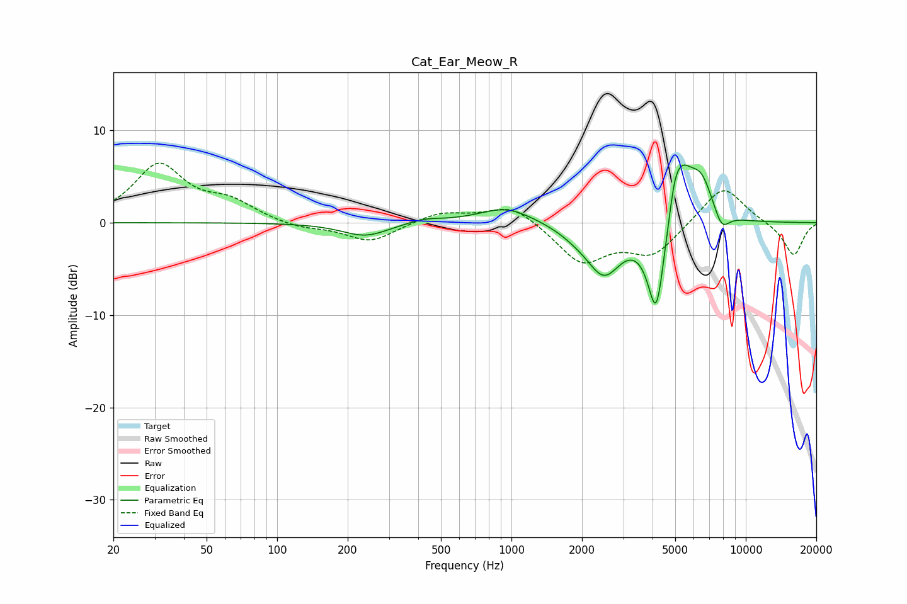

# Cat_Ear_Meow_R
See [usage instructions](https://github.com/jaakkopasanen/AutoEq#usage) for more options and info.

### Parametric EQs
Apply preamp of -6.3 dB when using parametric equalizer.

|   # | Type    |   Fc (Hz) |    Q |   Gain (dB) |
|-----|---------|-----------|------|-------------|
|   1 | Peaking |       238 | 1.43 |        -1.5 |
|   2 | Peaking |       425 | 1.89 |         0.5 |
|   3 | Peaking |       953 | 1.22 |         1.8 |
|   4 | Peaking |      1902 | 1.78 |        -0.7 |
|   5 | Peaking |      2485 | 1.9  |        -5.2 |
|   6 | Peaking |      4153 | 3.65 |       -10.6 |
|   7 | Peaking |      4956 | 6    |         2   |
|   8 | Peaking |      5280 | 2.69 |         6.1 |
|   9 | Peaking |      6450 | 2.5  |         4.3 |
|  10 | Peaking |      7880 | 3.98 |        -2.1 |

### Fixed Band EQs
When using fixed band (also called graphic) equalizer, apply preamp of **-6.5 dB** (if available) and set gains manually with these parameters.

|   # | Type    |   Fc (Hz) |    Q |   Gain (dB) |
|-----|---------|-----------|------|-------------|
|   1 | Peaking |        31 | 1.41 |         6.1 |
|   2 | Peaking |        62 | 1.41 |         1.9 |
|   3 | Peaking |       125 | 1.41 |        -0.6 |
|   4 | Peaking |       250 | 1.41 |        -2.1 |
|   5 | Peaking |       500 | 1.41 |         1.1 |
|   6 | Peaking |      1000 | 1.41 |         2.1 |
|   7 | Peaking |      2000 | 1.41 |        -4.2 |
|   8 | Peaking |      4000 | 1.41 |        -3.3 |
|   9 | Peaking |      8000 | 1.41 |         4.2 |
|  10 | Peaking |     16000 | 1.41 |        -3.6 |

### Graphs

