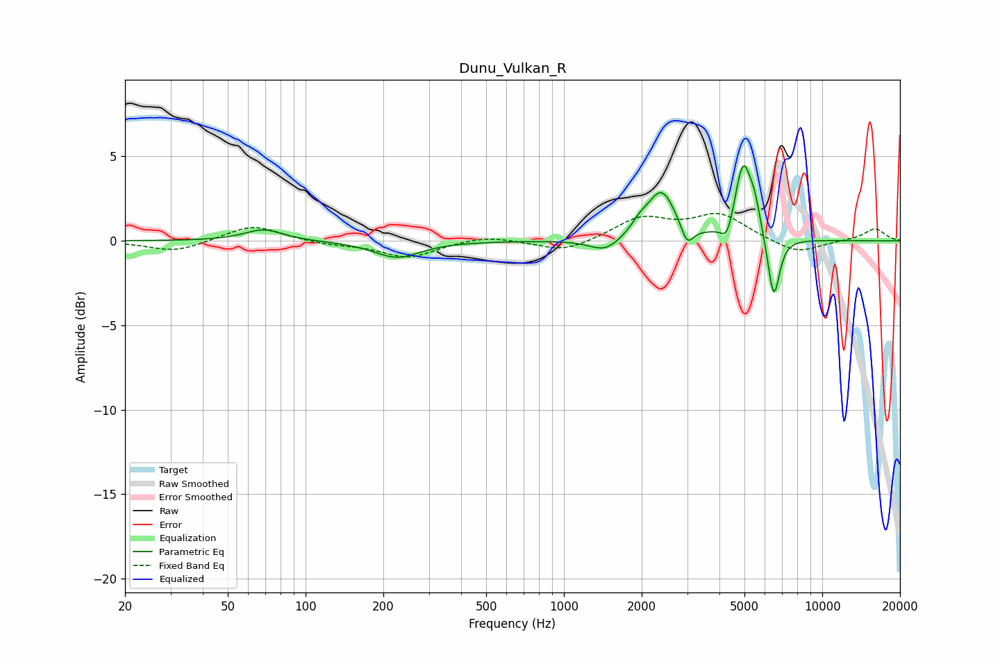

# Dunu_Vulkan_R
See [usage instructions](https://github.com/jaakkopasanen/AutoEq#usage) for more options and info.

### Parametric EQs
Apply preamp of -4.5 dB when using parametric equalizer.

|   # | Type    |   Fc (Hz) |    Q |   Gain (dB) |
|-----|---------|-----------|------|-------------|
|   1 | Peaking |        69 | 1.92 |         0.7 |
|   2 | Peaking |       226 | 1.56 |        -1   |
|   3 | Peaking |      1445 | 2.38 |        -0.8 |
|   4 | Peaking |      1965 | 4.34 |         0.5 |
|   5 | Peaking |      2389 | 2.6  |         2.9 |
|   6 | Peaking |      3002 | 5.92 |        -1.2 |
|   7 | Peaking |      4289 | 6    |        -1.1 |
|   8 | Peaking |      4938 | 4.32 |         4.4 |
|   9 | Peaking |      5484 | 6    |         1.4 |
|  10 | Peaking |      6490 | 6    |        -3.8 |

### Fixed Band EQs
When using fixed band (also called graphic) equalizer, apply preamp of **-1.7 dB** (if available) and set gains manually with these parameters.

|   # | Type    |   Fc (Hz) |    Q |   Gain (dB) |
|-----|---------|-----------|------|-------------|
|   1 | Peaking |        31 | 1.41 |        -0.7 |
|   2 | Peaking |        62 | 1.41 |         1   |
|   3 | Peaking |       125 | 1.41 |        -0.2 |
|   4 | Peaking |       250 | 1.41 |        -1   |
|   5 | Peaking |       500 | 1.41 |         0.3 |
|   6 | Peaking |      1000 | 1.41 |        -0.7 |
|   7 | Peaking |      2000 | 1.41 |         1.3 |
|   8 | Peaking |      4000 | 1.41 |         1.5 |
|   9 | Peaking |      8000 | 1.41 |        -0.8 |
|  10 | Peaking |     16000 | 1.41 |         0.7 |

### Graphs

