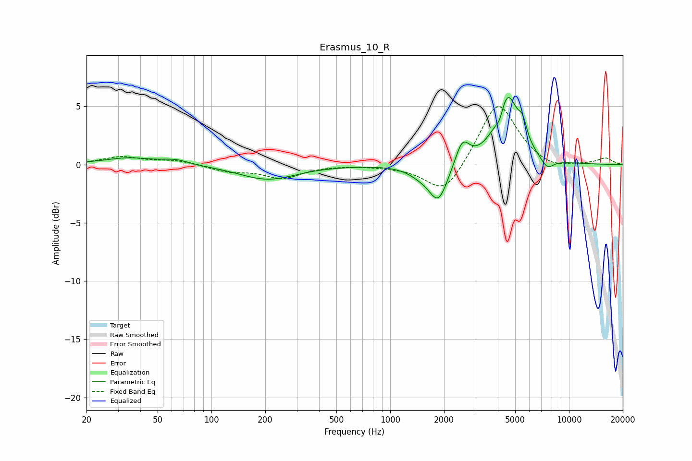

# Erasmus_10_R
See [usage instructions](https://github.com/jaakkopasanen/AutoEq#usage) for more options and info.

### Parametric EQs
Apply preamp of -5.9 dB when using parametric equalizer.

|   # | Type    |   Fc (Hz) |    Q |   Gain (dB) |
|-----|---------|-----------|------|-------------|
|   1 | Peaking |        34 | 1.05 |         0.6 |
|   2 | Peaking |        63 | 1.89 |         0.4 |
|   3 | Peaking |       206 | 0.89 |        -1.3 |
|   4 | Peaking |      1456 | 2.15 |        -0.6 |
|   5 | Peaking |      1859 | 2.64 |        -3.2 |
|   6 | Peaking |      2534 | 3.68 |         2.1 |
|   7 | Peaking |      4103 | 6    |        -1.2 |
|   8 | Peaking |      4496 | 2.2  |         6.1 |
|   9 | Peaking |      5509 | 6    |         1.4 |
|  10 | Peaking |      7559 | 3.67 |        -0.9 |

### Fixed Band EQs
When using fixed band (also called graphic) equalizer, apply preamp of **-5.1 dB** (if available) and set gains manually with these parameters.

|   # | Type    |   Fc (Hz) |    Q |   Gain (dB) |
|-----|---------|-----------|------|-------------|
|   1 | Peaking |        31 | 1.41 |         0.6 |
|   2 | Peaking |        62 | 1.41 |         0.4 |
|   3 | Peaking |       125 | 1.41 |        -0.5 |
|   4 | Peaking |       250 | 1.41 |        -1.1 |
|   5 | Peaking |       500 | 1.41 |         0   |
|   6 | Peaking |      1000 | 1.41 |        -0.1 |
|   7 | Peaking |      2000 | 1.41 |        -2.7 |
|   8 | Peaking |      4000 | 1.41 |         5.5 |
|   9 | Peaking |      8000 | 1.41 |        -0.5 |
|  10 | Peaking |     16000 | 1.41 |         0.5 |

### Graphs

