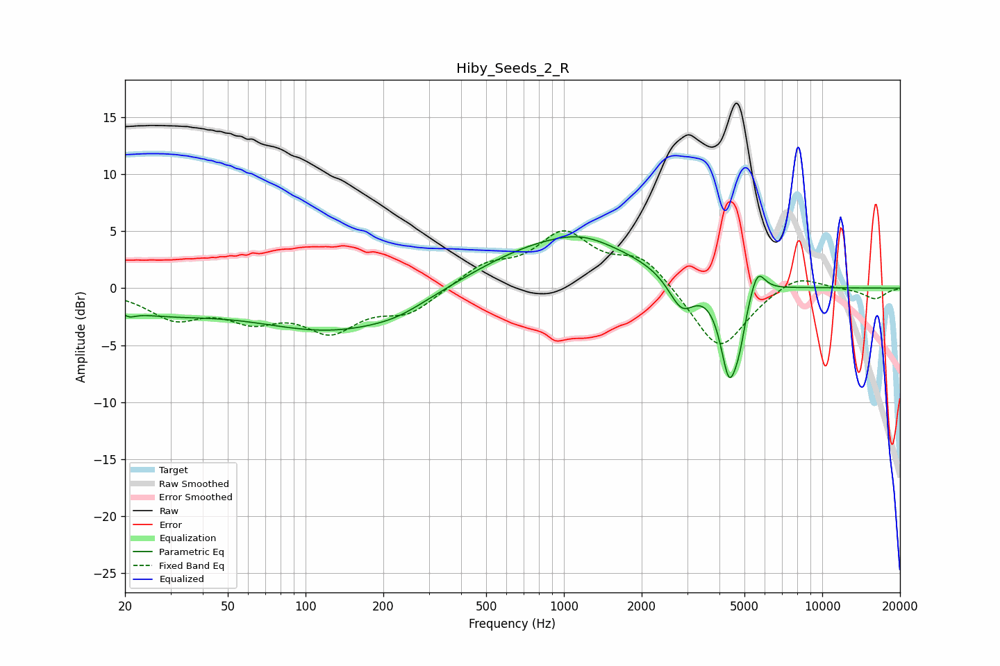

# Hiby_Seeds_2_R
See [usage instructions](https://github.com/jaakkopasanen/AutoEq#usage) for more options and info.

### Parametric EQs
Apply preamp of -4.6 dB when using parametric equalizer.

|   # | Type    |   Fc (Hz) |    Q |   Gain (dB) |
|-----|---------|-----------|------|-------------|
|   1 | Peaking |        21 | 5.62 |        -0.5 |
|   2 | Peaking |        26 | 0.61 |        -1.8 |
|   3 | Peaking |       135 | 0.45 |        -3.7 |
|   4 | Peaking |       228 | 1.38 |        -0.5 |
|   5 | Peaking |       961 | 0.44 |         4.4 |
|   6 | Peaking |      1182 | 1.37 |         0.6 |
|   7 | Peaking |      2856 | 2.74 |        -3   |
|   8 | Peaking |      4364 | 4.03 |        -7.7 |
|   9 | Peaking |      4786 | 6    |        -2.2 |
|  10 | Peaking |      5607 | 4.72 |         2.3 |

### Fixed Band EQs
When using fixed band (also called graphic) equalizer, apply preamp of **-5.1 dB** (if available) and set gains manually with these parameters.

|   # | Type    |   Fc (Hz) |    Q |   Gain (dB) |
|-----|---------|-----------|------|-------------|
|   1 | Peaking |        31 | 1.41 |        -2.4 |
|   2 | Peaking |        62 | 1.41 |        -2.3 |
|   3 | Peaking |       125 | 1.41 |        -3.4 |
|   4 | Peaking |       250 | 1.41 |        -2   |
|   5 | Peaking |       500 | 1.41 |         1.9 |
|   6 | Peaking |      1000 | 1.41 |         4.5 |
|   7 | Peaking |      2000 | 1.41 |         2.7 |
|   8 | Peaking |      4000 | 1.41 |        -5.7 |
|   9 | Peaking |      8000 | 1.41 |         1.4 |
|  10 | Peaking |     16000 | 1.41 |        -0.9 |

### Graphs

