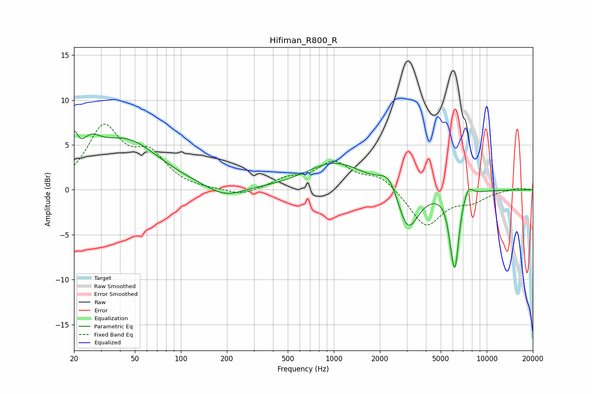

# Hifiman_R800_R
See [usage instructions](https://github.com/jaakkopasanen/AutoEq#usage) for more options and info.

### Parametric EQs
Apply preamp of -6.6 dB when using parametric equalizer.

|   # | Type    |   Fc (Hz) |    Q |   Gain (dB) |
|-----|---------|-----------|------|-------------|
|   1 | Peaking |        20 | 5.91 |         3   |
|   2 | Peaking |        26 | 2.16 |         2.4 |
|   3 | Peaking |        44 | 0.65 |         5.4 |
|   4 | Peaking |       193 | 1.22 |        -1.2 |
|   5 | Peaking |      1017 | 0.75 |         3   |
|   6 | Peaking |      2306 | 2.26 |         2.2 |
|   7 | Peaking |      3038 | 2.03 |        -5.2 |
|   8 | Peaking |      5812 | 6    |        -1.5 |
|   9 | Peaking |      6199 | 5.24 |        -7.8 |
|  10 | Peaking |      7557 | 4.61 |         1.3 |

### Fixed Band EQs
When using fixed band (also called graphic) equalizer, apply preamp of **-7.4 dB** (if available) and set gains manually with these parameters.

|   # | Type    |   Fc (Hz) |    Q |   Gain (dB) |
|-----|---------|-----------|------|-------------|
|   1 | Peaking |        31 | 1.41 |         6.7 |
|   2 | Peaking |        62 | 1.41 |         3.5 |
|   3 | Peaking |       125 | 1.41 |        -0.1 |
|   4 | Peaking |       250 | 1.41 |        -0.8 |
|   5 | Peaking |       500 | 1.41 |         1.1 |
|   6 | Peaking |      1000 | 1.41 |         2.9 |
|   7 | Peaking |      2000 | 1.41 |         1.5 |
|   8 | Peaking |      4000 | 1.41 |        -4.1 |
|   9 | Peaking |      8000 | 1.41 |        -1.1 |
|  10 | Peaking |     16000 | 1.41 |         0.2 |

### Graphs

