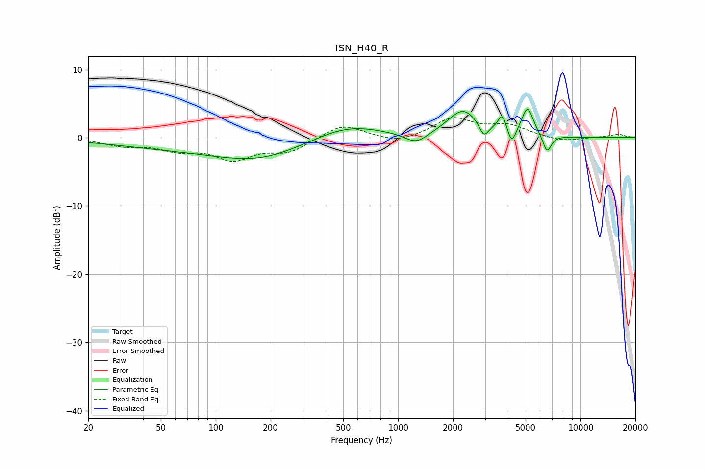

# ISN_H40_R
See [usage instructions](https://github.com/jaakkopasanen/AutoEq#usage) for more options and info.

### Parametric EQs
Apply preamp of -4.2 dB when using parametric equalizer.

|   # | Type    |   Fc (Hz) |    Q |   Gain (dB) |
|-----|---------|-----------|------|-------------|
|   1 | Peaking |       151 | 0.18 |        -1.9 |
|   2 | Peaking |       171 | 0.65 |        -1.7 |
|   3 | Peaking |       524 | 0.68 |         3   |
|   4 | Peaking |      1256 | 2.29 |        -1.6 |
|   5 | Peaking |      2272 | 1.69 |         4   |
|   6 | Peaking |      2951 | 5.83 |        -1.9 |
|   7 | Peaking |      3729 | 5.92 |         2.7 |
|   8 | Peaking |      4192 | 5.99 |        -2.4 |
|   9 | Peaking |      5124 | 4.27 |         4.2 |
|  10 | Peaking |      6556 | 5.86 |        -2.6 |

### Fixed Band EQs
When using fixed band (also called graphic) equalizer, apply preamp of **-3.0 dB** (if available) and set gains manually with these parameters.

|   # | Type    |   Fc (Hz) |    Q |   Gain (dB) |
|-----|---------|-----------|------|-------------|
|   1 | Peaking |        31 | 1.41 |        -1   |
|   2 | Peaking |        62 | 1.41 |        -1.5 |
|   3 | Peaking |       125 | 1.41 |        -2.9 |
|   4 | Peaking |       250 | 1.41 |        -1.9 |
|   5 | Peaking |       500 | 1.41 |         2   |
|   6 | Peaking |      1000 | 1.41 |        -0.9 |
|   7 | Peaking |      2000 | 1.41 |         2.8 |
|   8 | Peaking |      4000 | 1.41 |         1.6 |
|   9 | Peaking |      8000 | 1.41 |        -0.6 |
|  10 | Peaking |     16000 | 1.41 |         0.5 |

### Graphs

