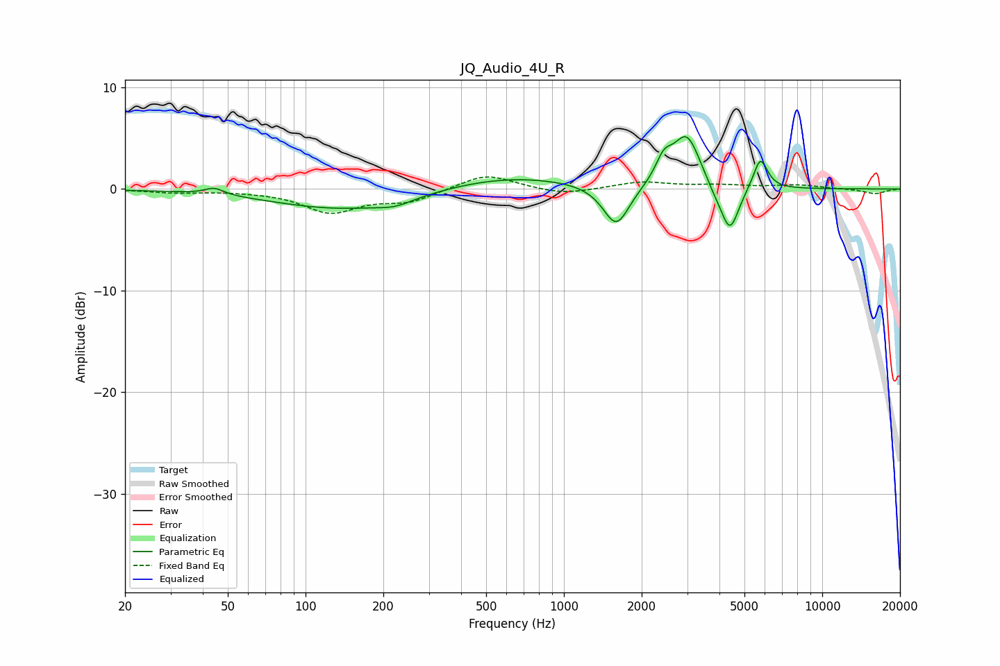

# JQ_Audio_4U_R
See [usage instructions](https://github.com/jaakkopasanen/AutoEq#usage) for more options and info.

### Parametric EQs
Apply preamp of -5.2 dB when using parametric equalizer.

|   # | Type    |   Fc (Hz) |    Q |   Gain (dB) |
|-----|---------|-----------|------|-------------|
|   1 | Peaking |        44 | 3.91 |         0.7 |
|   2 | Peaking |       141 | 0.52 |        -2   |
|   3 | Peaking |       222 | 2.08 |        -0.6 |
|   4 | Peaking |       600 | 0.54 |         1.4 |
|   5 | Peaking |      1596 | 2.77 |        -4.2 |
|   6 | Peaking |      2434 | 4.36 |         2.1 |
|   7 | Peaking |      2989 | 2.62 |         5.2 |
|   8 | Peaking |      3812 | 4.04 |        -0.7 |
|   9 | Peaking |      4389 | 3.95 |        -4.6 |
|  10 | Peaking |      5761 | 5.05 |         3.1 |

### Fixed Band EQs
When using fixed band (also called graphic) equalizer, apply preamp of **-1.3 dB** (if available) and set gains manually with these parameters.

|   # | Type    |   Fc (Hz) |    Q |   Gain (dB) |
|-----|---------|-----------|------|-------------|
|   1 | Peaking |        31 | 1.41 |        -0.3 |
|   2 | Peaking |        62 | 1.41 |        -0.1 |
|   3 | Peaking |       125 | 1.41 |        -2.2 |
|   4 | Peaking |       250 | 1.41 |        -1.2 |
|   5 | Peaking |       500 | 1.41 |         1.6 |
|   6 | Peaking |      1000 | 1.41 |        -0.6 |
|   7 | Peaking |      2000 | 1.41 |         0.7 |
|   8 | Peaking |      4000 | 1.41 |         0.3 |
|   9 | Peaking |      8000 | 1.41 |         0.4 |
|  10 | Peaking |     16000 | 1.41 |        -0.5 |

### Graphs

