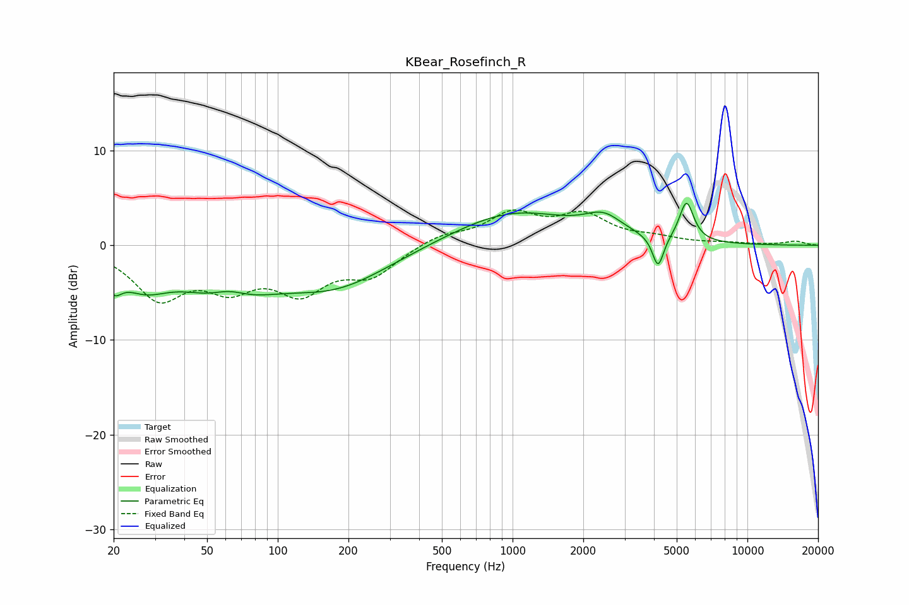

# KBear_Rosefinch_R
See [usage instructions](https://github.com/jaakkopasanen/AutoEq#usage) for more options and info.

### Parametric EQs
Apply preamp of -4.5 dB when using parametric equalizer.

|   # | Type    |   Fc (Hz) |    Q |   Gain (dB) |
|-----|---------|-----------|------|-------------|
|   1 | Peaking |        20 | 4.2  |        -2.3 |
|   2 | Peaking |        27 | 1.3  |        -3.2 |
|   3 | Peaking |        61 | 0.83 |        -5.2 |
|   4 | Peaking |        62 | 1.68 |         2   |
|   5 | Peaking |       176 | 0.6  |        -4.1 |
|   6 | Peaking |       879 | 0.69 |         0   |
|   7 | Peaking |      1007 | 0.56 |         3.6 |
|   8 | Peaking |      2441 | 1.77 |         2   |
|   9 | Peaking |      4165 | 5.9  |        -3.4 |
|  10 | Peaking |      5503 | 4.56 |         4.2 |

### Fixed Band EQs
When using fixed band (also called graphic) equalizer, apply preamp of **-3.8 dB** (if available) and set gains manually with these parameters.

|   # | Type    |   Fc (Hz) |    Q |   Gain (dB) |
|-----|---------|-----------|------|-------------|
|   1 | Peaking |        31 | 1.41 |        -5.2 |
|   2 | Peaking |        62 | 1.41 |        -3.6 |
|   3 | Peaking |       125 | 1.41 |        -4.3 |
|   4 | Peaking |       250 | 1.41 |        -2.9 |
|   5 | Peaking |       500 | 1.41 |         1.1 |
|   6 | Peaking |      1000 | 1.41 |         3.1 |
|   7 | Peaking |      2000 | 1.41 |         2.9 |
|   8 | Peaking |      4000 | 1.41 |         0.6 |
|   9 | Peaking |      8000 | 1.41 |         0.2 |
|  10 | Peaking |     16000 | 1.41 |         0.4 |

### Graphs

