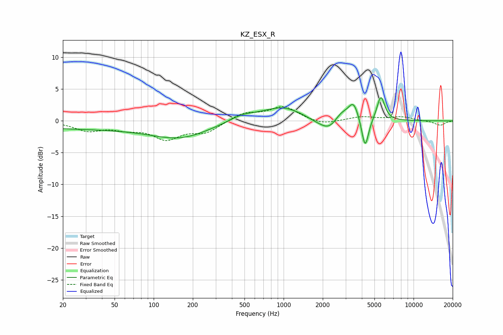

# KZ_ESX_R
See [usage instructions](https://github.com/jaakkopasanen/AutoEq#usage) for more options and info.

### Parametric EQs
Apply preamp of -3.8 dB when using parametric equalizer.

|   # | Type    |   Fc (Hz) |    Q |   Gain (dB) |
|-----|---------|-----------|------|-------------|
|   1 | Peaking |        39 | 0.18 |        -1.2 |
|   2 | Peaking |       163 | 0.68 |        -2   |
|   3 | Peaking |       479 | 1.36 |         0.9 |
|   4 | Peaking |       978 | 0.9  |         2.2 |
|   5 | Peaking |      1804 | 1.72 |        -0.6 |
|   6 | Peaking |      2235 | 2.21 |        -1.6 |
|   7 | Peaking |      2786 | 2.75 |         1.2 |
|   8 | Peaking |      3448 | 3.55 |         2.8 |
|   9 | Peaking |      4238 | 5.33 |        -4.9 |
|  10 | Peaking |      5599 | 4.69 |         3.9 |

### Fixed Band EQs
When using fixed band (also called graphic) equalizer, apply preamp of **-2.3 dB** (if available) and set gains manually with these parameters.

|   # | Type    |   Fc (Hz) |    Q |   Gain (dB) |
|-----|---------|-----------|------|-------------|
|   1 | Peaking |        31 | 1.41 |        -1.4 |
|   2 | Peaking |        62 | 1.41 |        -1   |
|   3 | Peaking |       125 | 1.41 |        -2.6 |
|   4 | Peaking |       250 | 1.41 |        -1.7 |
|   5 | Peaking |       500 | 1.41 |         1.3 |
|   6 | Peaking |      1000 | 1.41 |         2.2 |
|   7 | Peaking |      2000 | 1.41 |        -0.7 |
|   8 | Peaking |      4000 | 1.41 |         0.6 |
|   9 | Peaking |      8000 | 1.41 |         0.6 |
|  10 | Peaking |     16000 | 1.41 |        -0.7 |

### Graphs

