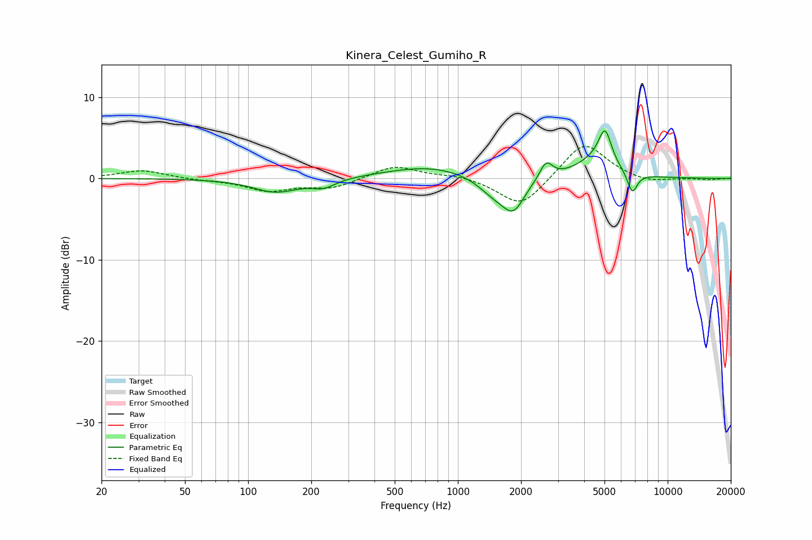

# Kinera_Celest_Gumiho_R
See [usage instructions](https://github.com/jaakkopasanen/AutoEq#usage) for more options and info.

### Parametric EQs
Apply preamp of -5.9 dB when using parametric equalizer.

|   # | Type    |   Fc (Hz) |    Q |   Gain (dB) |
|-----|---------|-----------|------|-------------|
|   1 | Peaking |       135 | 1.29 |        -1.7 |
|   2 | Peaking |       229 | 2.48 |        -1   |
|   3 | Peaking |       732 | 0.68 |         1.5 |
|   4 | Peaking |      1428 | 1.86 |        -1.5 |
|   5 | Peaking |      1558 | 2.88 |        -0.4 |
|   6 | Peaking |      1840 | 2.61 |        -3.8 |
|   7 | Peaking |      2634 | 4.73 |         2.1 |
|   8 | Peaking |      4488 | 1.48 |         1.9 |
|   9 | Peaking |      5029 | 4.45 |         4.3 |
|  10 | Peaking |      6784 | 5.79 |        -2.6 |

### Fixed Band EQs
When using fixed band (also called graphic) equalizer, apply preamp of **-4.0 dB** (if available) and set gains manually with these parameters.

|   # | Type    |   Fc (Hz) |    Q |   Gain (dB) |
|-----|---------|-----------|------|-------------|
|   1 | Peaking |        31 | 1.41 |         1   |
|   2 | Peaking |        62 | 1.41 |        -0.2 |
|   3 | Peaking |       125 | 1.41 |        -1.5 |
|   4 | Peaking |       250 | 1.41 |        -1.2 |
|   5 | Peaking |       500 | 1.41 |         1.6 |
|   6 | Peaking |      1000 | 1.41 |         0.4 |
|   7 | Peaking |      2000 | 1.41 |        -3.7 |
|   8 | Peaking |      4000 | 1.41 |         4.6 |
|   9 | Peaking |      8000 | 1.41 |        -0.6 |
|  10 | Peaking |     16000 | 1.41 |        -0.2 |

### Graphs

