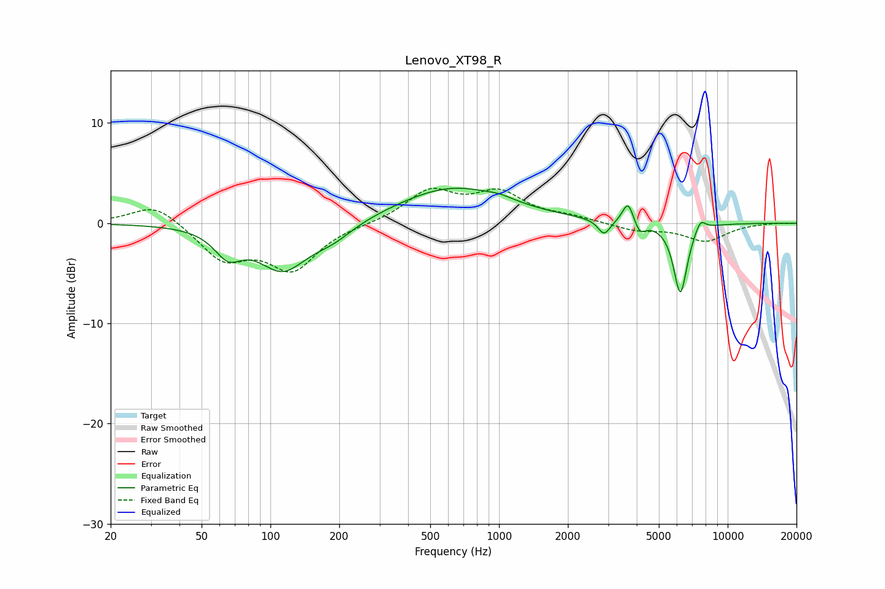

# Lenovo_XT98_R
See [usage instructions](https://github.com/jaakkopasanen/AutoEq#usage) for more options and info.

### Parametric EQs
Apply preamp of -3.6 dB when using parametric equalizer.

|   # | Type    |   Fc (Hz) |    Q |   Gain (dB) |
|-----|---------|-----------|------|-------------|
|   1 | Peaking |        65 | 2.41 |        -2.5 |
|   2 | Peaking |       113 | 1.29 |        -4.5 |
|   3 | Peaking |       188 | 1.52 |        -1.3 |
|   4 | Peaking |       630 | 0.58 |         3.6 |
|   5 | Peaking |      1012 | 2.68 |         0.3 |
|   6 | Peaking |      2880 | 5.36 |        -1.5 |
|   7 | Peaking |      3663 | 5.93 |         2.2 |
|   8 | Peaking |      4132 | 6    |        -1.2 |
|   9 | Peaking |      6210 | 4.59 |        -7.1 |
|  10 | Peaking |      7594 | 5.86 |         1.2 |

### Fixed Band EQs
When using fixed band (also called graphic) equalizer, apply preamp of **-3.6 dB** (if available) and set gains manually with these parameters.

|   # | Type    |   Fc (Hz) |    Q |   Gain (dB) |
|-----|---------|-----------|------|-------------|
|   1 | Peaking |        31 | 1.41 |         2.1 |
|   2 | Peaking |        62 | 1.41 |        -3.5 |
|   3 | Peaking |       125 | 1.41 |        -4.4 |
|   4 | Peaking |       250 | 1.41 |        -0.1 |
|   5 | Peaking |       500 | 1.41 |         3.1 |
|   6 | Peaking |      1000 | 1.41 |         2.8 |
|   7 | Peaking |      2000 | 1.41 |         0.5 |
|   8 | Peaking |      4000 | 1.41 |        -0.7 |
|   9 | Peaking |      8000 | 1.41 |        -1.7 |
|  10 | Peaking |     16000 | 1.41 |         0   |

### Graphs

