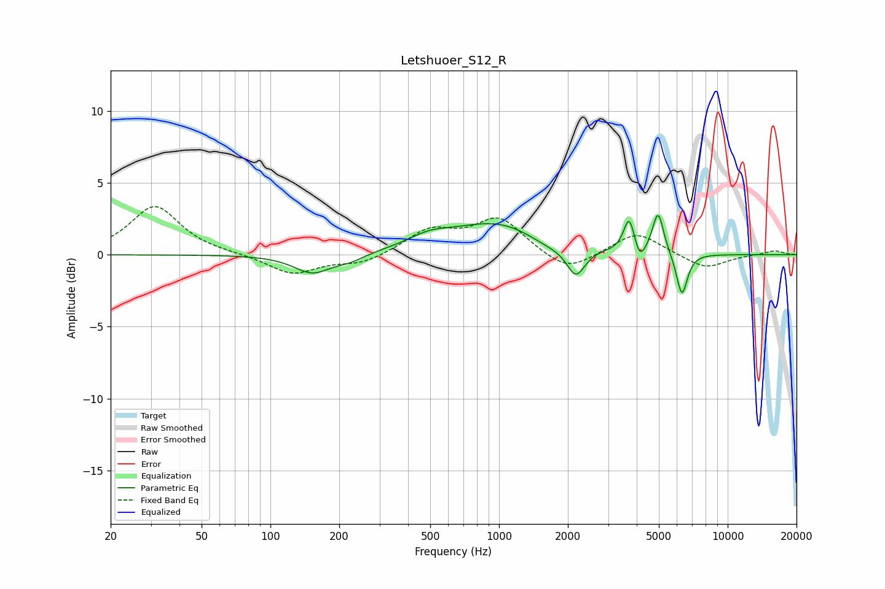

# Letshuoer_S12_R
See [usage instructions](https://github.com/jaakkopasanen/AutoEq#usage) for more options and info.

### Parametric EQs
Apply preamp of -2.8 dB when using parametric equalizer.

|   # | Type    |   Fc (Hz) |    Q |   Gain (dB) |
|-----|---------|-----------|------|-------------|
|   1 | Peaking |       153 | 1.74 |        -1.3 |
|   2 | Peaking |       223 | 2.18 |        -0.4 |
|   3 | Peaking |       492 | 1.55 |         0.7 |
|   4 | Peaking |       992 | 0.66 |         2.3 |
|   5 | Peaking |      1608 | 1.49 |        -0.6 |
|   6 | Peaking |      2169 | 3.51 |        -2   |
|   7 | Peaking |      3709 | 6    |         2.4 |
|   8 | Peaking |      4129 | 6    |        -1.1 |
|   9 | Peaking |      4963 | 5.77 |         2.9 |
|  10 | Peaking |      6307 | 5.73 |        -3   |

### Fixed Band EQs
When using fixed band (also called graphic) equalizer, apply preamp of **-3.4 dB** (if available) and set gains manually with these parameters.

|   # | Type    |   Fc (Hz) |    Q |   Gain (dB) |
|-----|---------|-----------|------|-------------|
|   1 | Peaking |        31 | 1.41 |         3.4 |
|   2 | Peaking |        62 | 1.41 |         0   |
|   3 | Peaking |       125 | 1.41 |        -1.4 |
|   4 | Peaking |       250 | 1.41 |        -0.6 |
|   5 | Peaking |       500 | 1.41 |         1.6 |
|   6 | Peaking |      1000 | 1.41 |         2.5 |
|   7 | Peaking |      2000 | 1.41 |        -1.3 |
|   8 | Peaking |      4000 | 1.41 |         1.6 |
|   9 | Peaking |      8000 | 1.41 |        -1   |
|  10 | Peaking |     16000 | 1.41 |         0.3 |

### Graphs

